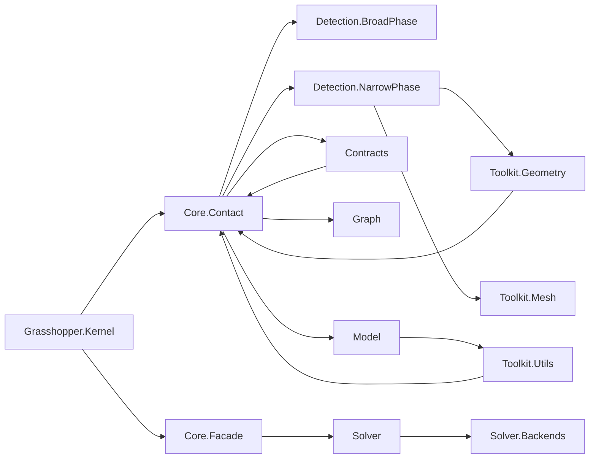

# AssemblyChain Codebase Audit

## 1. Repository Metrics

- Analysed scope: `src`
- Total C# files: 113
- Total lines of code (LOC) / source lines (SLOC): 16,477 / 14,341
- Average LOC per file: 145.8
- Average method cyclomatic complexity: 2.66
- Maximum method cyclomatic complexity: 17
- Average XML documentation density: 18.41%
- Async methods detected: 6
- Duplicate code fragments detected (8-line window): 53

## 2. Directory & Module Structure

```text
src
├── AssemblyChain.Core
│   ├── Contact
│   │   ├── Detection
│   │   │   ├── BroadPhase
│   │   │   ├── NarrowPhase
│   │   │   └── DetectionOptions.cs
│   │   ├── ContactGraphBuilder.cs
│   │   ├── ContactModel.cs
│   │   └── ContactUtils.cs
│   ├── Contracts
│   ├── Data
│   ├── Domain
│   │   ├── Common
│   │   ├── Entities
│   │   ├── Interfaces
│   │   ├── Services
│   │   └── ValueObjects
│   ├── Facade
│   ├── Graph
│   ├── Learning
│   ├── Model
│   ├── Motion
│   ├── Robotics
│   ├── Solver
│   │   └── Backends
│   └── Toolkit
│       ├── BBox
│       ├── Brep
│       ├── Extensions
│       ├── Geometry
│       ├── Intersection
│       ├── Math
│       ├── Mesh
│       │   ├── Preprocessing
│       ├── Processing
│       └── Utils
└── AssemblyChain.Grasshopper
    ├── Components
    │   ├── 1_Property
    │   ├── 2_Part
    │   ├── 3_Solver
    │   └── 4_Simulation
    ├── Kernel
    │   ├── Goo
    │   └── Params
    ├── Properties
    └── UI
```

## 3. Architectural Dependency Map

| Namespace | Fan-out | Fan-in | Key Dependencies |
| --- | --- | --- | --- |
| `AssemblyChain.Core.Contact` | 7 | 11 | `Contact.Detection.BroadPhase`, `Contact.Detection.NarrowPhase`, `Contracts`, `Domain.Entities`, `Graph`, `Model`, `Rhino.Geometry` |
| `AssemblyChain.Core.Contact.Detection.NarrowPhase` | 8 | 1 | `Contact`, `Domain.Entities`, `Model`, `Toolkit`, `Toolkit.Geometry`, `Toolkit.Mesh`, `Toolkit.Utils`, `Rhino.Geometry` |
| `AssemblyChain.Core.Model` | 3 | 16 | `Domain.Entities`, `Toolkit.Utils`, `Rhino.Geometry` |
| `AssemblyChain.Core.Toolkit.Utils` | 7 | 2 | `Contact`, `Domain.Entities`, `Model`, `Toolkit.Extensions`, `Newtonsoft.Json`, `Rhino.Geometry` |
| `AssemblyChain.Gh.Kernel` | 11 | 0 | `AssemblyChain.Core` (multiple namespaces), `Grasshopper.Kernel`, `Rhino.Geometry` |



*Detected cyclic dependencies:* `Core.Contact ↔ Contact.Detection.NarrowPhase`, `Core.Contact ↔ Contact.Detection.BroadPhase ↔ Core.Model ↔ Toolkit.Utils`, `Core.Model ↔ Toolkit.Utils`, `Core.Contact ↔ Contracts`, and `Core.Contact ↔ Contact.Detection.NarrowPhase ↔ Toolkit.Geometry`.

## 4. File-Level Metrics

| File | LOC | SLOC | Methods | Avg Complexity | Max Complexity | Doc % | Await Count |
| --- | --- | --- | --- | --- | --- | --- | --- |
| `AssemblyChain.Core/Contact/ContactGraphBuilder.cs` | 96 | 83 | 4 | 3.00 | 4 | 6.2% | 0 |
| `AssemblyChain.Core/Contact/ContactModel.cs` | 235 | 203 | 13 | 1.38 | 5 | 29.4% | 0 |
| `AssemblyChain.Core/Contact/ContactUtils.cs` | 69 | 62 | 2 | 3.50 | 4 | 5.8% | 0 |
| `AssemblyChain.Core/Contact/Detection/BroadPhase/RTreeBroadPhase.cs` | 202 | 170 | 7 | 2.43 | 7 | 15.3% | 0 |
| `AssemblyChain.Core/Contact/Detection/BroadPhase/SweepAndPrune.cs` | 274 | 241 | 7 | 2.71 | 7 | 19.0% | 0 |
| `AssemblyChain.Core/Contact/Detection/ContactDetection.cs` | 116 | 95 | 2 | 4.50 | 5 | 7.8% | 0 |
| `AssemblyChain.Core/Contact/Detection/DetectionOptions.cs` | 50 | 44 | 0 | 0.00 | 0 | 12.0% | 0 |
| `AssemblyChain.Core/Contact/Detection/NarrowPhase/BrepContactDetector.cs` | 58 | 49 | 1 | 4.00 | 4 | 10.3% | 0 |
| `AssemblyChain.Core/Contact/Detection/NarrowPhase/MeshContactDetector.Testing.cs` | 88 | 76 | 3 | 1.33 | 2 | 17.0% | 0 |
| `AssemblyChain.Core/Contact/Detection/NarrowPhase/MeshContactDetector.cs` | 679 | 568 | 13 | 4.85 | 15 | 5.9% | 0 |
| `AssemblyChain.Core/Contact/Detection/NarrowPhase/MixedGeoContactDetector.cs` | 117 | 102 | 2 | 5.00 | 6 | 7.7% | 0 |
| `AssemblyChain.Core/Contact/Detection/NarrowPhase/NarrowPhaseDetection.cs` | 78 | 66 | 3 | 2.00 | 4 | 7.7% | 0 |
| `AssemblyChain.Core/Contracts/AssemblyPlanRequest.cs` | 60 | 54 | 1 | 1.00 | 1 | 43.3% | 0 |
| `AssemblyChain.Core/Contracts/AssemblyPlanResult.cs` | 33 | 30 | 1 | 1.00 | 1 | 42.4% | 0 |
| `AssemblyChain.Core/Contracts/ContactZone.cs` | 53 | 47 | 2 | 1.00 | 1 | 43.4% | 0 |
| `AssemblyChain.Core/Contracts/DatasetExportOptions.cs` | 25 | 22 | 0 | 0.00 | 0 | 48.0% | 0 |
| `AssemblyChain.Core/Contracts/DatasetExportResult.cs` | 29 | 27 | 1 | 1.00 | 1 | 48.3% | 0 |
| `AssemblyChain.Core/Contracts/IContactUtils.cs` | 27 | 26 | 0 | 0.00 | 0 | 40.7% | 0 |
| `AssemblyChain.Core/Contracts/NarrowPhaseResult.cs` | 116 | 105 | 5 | 1.40 | 3 | 26.7% | 0 |
| `AssemblyChain.Core/Contracts/OnnxInferenceRequest.cs` | 32 | 29 | 1 | 1.00 | 1 | 43.8% | 0 |
| `AssemblyChain.Core/Contracts/OnnxInferenceResult.cs` | 24 | 22 | 1 | 1.00 | 1 | 41.7% | 0 |
| `AssemblyChain.Core/Contracts/ProcessExportOptions.cs` | 30 | 26 | 0 | 0.00 | 0 | 50.0% | 0 |
| `AssemblyChain.Core/Data/DatasetExporter.cs` | 109 | 89 | 1 | 6.00 | 6 | 10.1% | 0 |
| `AssemblyChain.Core/Domain/Common/Entity.cs` | 49 | 38 | 3 | 2.00 | 4 | 12.2% | 0 |
| `AssemblyChain.Core/Domain/Common/ValueObject.cs` | 56 | 42 | 2 | 2.00 | 3 | 5.4% | 0 |
| `AssemblyChain.Core/Domain/Entities/Assembly.cs` | 238 | 202 | 12 | 2.25 | 4 | 26.5% | 0 |
| `AssemblyChain.Core/Domain/Entities/Joint.cs` | 145 | 121 | 5 | 1.60 | 3 | 35.2% | 0 |
| `AssemblyChain.Core/Domain/Entities/Part.cs` | 174 | 148 | 6 | 1.17 | 2 | 36.2% | 0 |
| `AssemblyChain.Core/Domain/Interfaces/IAssemblyService.cs` | 81 | 71 | 0 | 0.00 | 0 | 40.7% | 0 |
| `AssemblyChain.Core/Domain/Interfaces/IPartRepository.cs` | 57 | 48 | 0 | 0.00 | 0 | 52.6% | 0 |
| `AssemblyChain.Core/Domain/Services/DomainServices.cs` | 303 | 256 | 16 | 2.00 | 5 | 10.9% | 3 |
| `AssemblyChain.Core/Domain/ValueObjects/MaterialProperties.cs` | 93 | 79 | 2 | 1.00 | 1 | 32.3% | 0 |
| `AssemblyChain.Core/Domain/ValueObjects/PartGeometry.cs` | 89 | 76 | 3 | 1.00 | 1 | 37.1% | 0 |
| `AssemblyChain.Core/Domain/ValueObjects/PhysicsProperties.cs` | 61 | 51 | 2 | 1.00 | 1 | 29.5% | 0 |
| `AssemblyChain.Core/Facade/AssemblyChainFacade.cs` | 259 | 234 | 13 | 1.69 | 3 | 28.2% | 0 |
| `AssemblyChain.Core/Graph/ConstraintGraphBuilder.cs` | 139 | 113 | 4 | 3.00 | 5 | 4.3% | 0 |
| `AssemblyChain.Core/Graph/GNNAnalyzer.cs` | 626 | 531 | 19 | 3.11 | 10 | 8.8% | 0 |
| `AssemblyChain.Core/Graph/GraphOptions.cs` | 14 | 12 | 0 | 0.00 | 0 | 21.4% | 0 |
| `AssemblyChain.Core/Graph/GraphViews.cs` | 76 | 62 | 10 | 1.00 | 1 | 0.0% | 0 |
| `AssemblyChain.Core/Learning/OnnxInferenceService.cs` | 44 | 39 | 1 | 3.00 | 3 | 20.5% | 0 |
| `AssemblyChain.Core/Model/AssemblyModel.cs` | 86 | 73 | 1 | 4.00 | 4 | 29.1% | 0 |
| `AssemblyChain.Core/Model/AssemblyModelFactory.cs` | 42 | 39 | 2 | 1.50 | 2 | 21.4% | 0 |
| `AssemblyChain.Core/Model/ConstraintModel.cs` | 72 | 62 | 6 | 1.50 | 3 | 5.6% | 0 |
| `AssemblyChain.Core/Model/ConstraintModelFactory.cs` | 50 | 45 | 1 | 2.00 | 2 | 16.0% | 0 |
| `AssemblyChain.Core/Model/GraphModel.cs` | 82 | 73 | 7 | 1.14 | 2 | 4.9% | 0 |
| `AssemblyChain.Core/Model/MotionModel.cs` | 86 | 72 | 8 | 1.75 | 4 | 4.7% | 0 |
| `AssemblyChain.Core/Model/SolverModel.cs` | 131 | 117 | 6 | 2.00 | 4 | 3.1% | 0 |
| `AssemblyChain.Core/Motion/ConeIntersection.cs` | 51 | 44 | 4 | 1.00 | 1 | 29.4% | 0 |
| `AssemblyChain.Core/Motion/MotionEvaluator.cs` | 123 | 101 | 6 | 3.33 | 7 | 4.9% | 0 |
| `AssemblyChain.Core/Motion/MotionOptions.cs` | 15 | 13 | 0 | 0.00 | 0 | 20.0% | 0 |
| `AssemblyChain.Core/Motion/PoseEstimator.cs` | 26 | 22 | 2 | 1.00 | 1 | 0.0% | 0 |
| `AssemblyChain.Core/Motion/PoseTypes.cs` | 16 | 14 | 1 | 1.00 | 1 | 0.0% | 0 |
| `AssemblyChain.Core/Robotics/ProcessSchema.cs` | 225 | 196 | 5 | 2.40 | 5 | 31.1% | 0 |
| `AssemblyChain.Core/Solver/Backends/ISolverBackend.cs` | 100 | 90 | 1 | 1.00 | 1 | 42.0% | 0 |
| `AssemblyChain.Core/Solver/Backends/OrToolsBackend.cs` | 760 | 663 | 29 | 3.52 | 11 | 1.2% | 0 |
| `AssemblyChain.Core/Solver/BaseSolver.cs` | 140 | 126 | 5 | 2.00 | 5 | 12.9% | 0 |
| `AssemblyChain.Core/Solver/CSPSolver.cs` | 33 | 32 | 0 | 0.00 | 0 | 39.4% | 0 |
| `AssemblyChain.Core/Solver/MILPSolver.cs` | 34 | 32 | 0 | 0.00 | 0 | 38.2% | 0 |
| `AssemblyChain.Core/Solver/SATSolver.cs` | 34 | 32 | 0 | 0.00 | 0 | 38.2% | 0 |
| `AssemblyChain.Core/Solver/SolverOptions.cs` | 29 | 26 | 0 | 0.00 | 0 | 20.7% | 0 |
| `AssemblyChain.Core/Toolkit/BBox/BoundingHelpers.cs` | 287 | 254 | 13 | 3.00 | 7 | 16.7% | 0 |
| `AssemblyChain.Core/Toolkit/Brep/BrepUtilities.cs` | 302 | 259 | 9 | 4.56 | 9 | 12.9% | 0 |
| `AssemblyChain.Core/Toolkit/Brep/PlanarOps.Types.cs` | 73 | 63 | 0 | 0.00 | 0 | 53.4% | 0 |
| `AssemblyChain.Core/Toolkit/Brep/PlanarOps.cs` | 472 | 393 | 13 | 5.08 | 16 | 6.4% | 0 |
| `AssemblyChain.Core/Toolkit/Extensions/HalfspaceConeExtensions.cs` | 59 | 54 | 3 | 2.00 | 4 | 39.0% | 0 |
| `AssemblyChain.Core/Toolkit/Geometry/MeshGeometry.cs` | 235 | 209 | 10 | 2.90 | 6 | 20.0% | 0 |
| `AssemblyChain.Core/Toolkit/Geometry/PlaneOperations.cs` | 341 | 293 | 10 | 2.80 | 7 | 22.0% | 0 |
| `AssemblyChain.Core/Toolkit/Intersection/BrepBrepIntersect.cs` | 308 | 268 | 8 | 4.12 | 9 | 10.7% | 0 |
| `AssemblyChain.Core/Toolkit/Intersection/MeshMeshIntersect.cs` | 383 | 330 | 12 | 3.33 | 6 | 8.6% | 0 |
| `AssemblyChain.Core/Toolkit/Math/Clustering.cs` | 317 | 291 | 12 | 4.83 | 11 | 0.9% | 0 |
| `AssemblyChain.Core/Toolkit/Math/ConvexCone.cs` | 316 | 288 | 22 | 1.82 | 4 | 40.2% | 0 |
| `AssemblyChain.Core/Toolkit/Math/LinearAlgebra.cs` | 173 | 158 | 10 | 2.10 | 5 | 21.4% | 0 |
| `AssemblyChain.Core/Toolkit/Mesh/MeshPreprocessor.Types.cs` | 89 | 65 | 2 | 1.00 | 1 | 16.9% | 0 |
| `AssemblyChain.Core/Toolkit/Mesh/MeshPreprocessor.cs` | 288 | 255 | 11 | 3.91 | 16 | 4.5% | 0 |
| `AssemblyChain.Core/Toolkit/Mesh/MeshSpatialIndex.cs` | 211 | 185 | 12 | 2.33 | 7 | 19.4% | 0 |
| `AssemblyChain.Core/Toolkit/Mesh/MeshToBrep.cs` | 223 | 194 | 6 | 3.33 | 5 | 12.6% | 0 |
| `AssemblyChain.Core/Toolkit/Mesh/Preprocessing/MeshOptimizer.cs` | 495 | 436 | 17 | 4.35 | 10 | 4.6% | 0 |
| `AssemblyChain.Core/Toolkit/Mesh/Preprocessing/MeshRepair.cs` | 369 | 329 | 12 | 4.17 | 11 | 3.3% | 0 |
| `AssemblyChain.Core/Toolkit/Mesh/Preprocessing/MeshValidator.cs` | 341 | 304 | 10 | 4.30 | 9 | 5.3% | 0 |
| `AssemblyChain.Core/Toolkit/Processing/AssemblyBuilder.cs` | 80 | 69 | 4 | 2.25 | 5 | 3.8% | 0 |
| `AssemblyChain.Core/Toolkit/Processing/ContactZoneExtractor.cs` | 123 | 103 | 4 | 3.00 | 5 | 2.4% | 0 |
| `AssemblyChain.Core/Toolkit/Processing/PartCreationProcessor.cs` | 190 | 162 | 9 | 3.11 | 5 | 2.1% | 0 |
| `AssemblyChain.Core/Toolkit/Processing/ProcessingMessage.cs` | 36 | 32 | 1 | 1.00 | 1 | 33.3% | 0 |
| `AssemblyChain.Core/Toolkit/Utils/CacheManager.cs` | 230 | 209 | 12 | 2.33 | 4 | 20.0% | 1 |
| `AssemblyChain.Core/Toolkit/Utils/ContactDetectionHelpers.cs` | 26 | 25 | 1 | 2.00 | 2 | 23.1% | 0 |
| `AssemblyChain.Core/Toolkit/Utils/ExtremeRayExtractor.cs` | 81 | 72 | 2 | 7.50 | 8 | 7.4% | 0 |
| `AssemblyChain.Core/Toolkit/Utils/GroupCandidates.cs` | 118 | 103 | 4 | 5.00 | 7 | 15.3% | 0 |
| `AssemblyChain.Core/Toolkit/Utils/HalfspaceCone.cs` | 40 | 34 | 3 | 1.00 | 1 | 30.0% | 0 |
| `AssemblyChain.Core/Toolkit/Utils/Hashing.cs` | 103 | 92 | 10 | 1.10 | 2 | 11.7% | 0 |
| `AssemblyChain.Core/Toolkit/Utils/JsonSerializer.cs` | 278 | 248 | 18 | 2.56 | 8 | 1.1% | 0 |
| `AssemblyChain.Core/Toolkit/Utils/ParallelProcessor.cs` | 196 | 176 | 2 | 3.00 | 5 | 12.2% | 3 |
| `AssemblyChain.Core/Toolkit/Utils/PerformanceMonitor.cs` | 224 | 199 | 15 | 1.47 | 5 | 29.5% | 0 |
| `AssemblyChain.Core/Toolkit/Utils/Tolerance.cs` | 171 | 150 | 16 | 1.94 | 12 | 3.5% | 0 |
| `AssemblyChain.Grasshopper/Components/1_Property/AcGhDefinePhysicalProperty.cs` | 88 | 76 | 3 | 3.00 | 7 | 3.4% | 0 |
| `AssemblyChain.Grasshopper/Components/2_Part/AcGhCreateAssembly.cs` | 133 | 116 | 6 | 1.83 | 4 | 0.0% | 0 |
| `AssemblyChain.Grasshopper/Components/2_Part/AcGhCreatePart.cs` | 380 | 332 | 21 | 2.19 | 9 | 2.4% | 0 |
| `AssemblyChain.Grasshopper/Components/3_Solver/AcGhBuildContactModel.cs` | 105 | 87 | 3 | 2.00 | 4 | 0.0% | 0 |
| `AssemblyChain.Grasshopper/Components/3_Solver/AcGhContactZones.cs` | 114 | 99 | 7 | 1.86 | 3 | 0.0% | 0 |
| `AssemblyChain.Grasshopper/Kernel/Goo/AcGhAssemblyWrapGoo.cs` | 96 | 81 | 5 | 2.00 | 4 | 3.1% | 0 |
| `AssemblyChain.Grasshopper/Kernel/Goo/AcGhContactModelGoo.cs` | 69 | 58 | 5 | 1.80 | 4 | 4.3% | 0 |
| `AssemblyChain.Grasshopper/Kernel/Goo/AcGhGooBase.cs` | 55 | 48 | 4 | 1.00 | 1 | 41.8% | 0 |
| `AssemblyChain.Grasshopper/Kernel/Goo/AcGhPartWrapGoo.cs` | 142 | 125 | 5 | 2.00 | 5 | 10.6% | 0 |
| `AssemblyChain.Grasshopper/Kernel/Goo/AcGhPhysicalPropertyGoo.cs` | 66 | 56 | 5 | 1.80 | 4 | 4.5% | 0 |
| `AssemblyChain.Grasshopper/Kernel/Params/AcGhAssemblyWrapParam.cs` | 13 | 11 | 0 | 0.00 | 0 | 0.0% | 0 |
| `AssemblyChain.Grasshopper/Kernel/Params/AcGhContactModelParam.cs` | 19 | 18 | 0 | 0.00 | 0 | 36.8% | 0 |
| `AssemblyChain.Grasshopper/Kernel/Params/AcGhParamBase.cs` | 49 | 45 | 3 | 1.00 | 1 | 38.8% | 0 |
| `AssemblyChain.Grasshopper/Kernel/Params/AcGhPartWrapParam.cs` | 19 | 18 | 0 | 0.00 | 0 | 36.8% | 0 |
| `AssemblyChain.Grasshopper/Kernel/Params/AcGhPhysicalPropertyParam.cs` | 19 | 18 | 0 | 0.00 | 0 | 36.8% | 0 |
| `AssemblyChain.Grasshopper/Properties/AssemblyInfo.cs` | 38 | 33 | 0 | 0.00 | 0 | 0.0% | 0 |
| `AssemblyChain.Grasshopper/UI/ACDBGConduit.cs` | 361 | 325 | 10 | 4.10 | 17 | 0.0% | 0 |
| `AssemblyChain.Grasshopper/UI/ACPreviewConduit.cs` | 167 | 149 | 3 | 6.00 | 15 | 0.0% | 0 |
| `AssemblyChain.Grasshopper/UI/Attributes/ComponentButton.cs` | 81 | 72 | 6 | 1.83 | 5 | 0.0% | 0 |
| `AssemblyChain.Grasshopper/UI/ComponentForm.cs` | 46 | 41 | 3 | 1.00 | 1 | 0.0% | 0 |

## 5. Hotspots & Duplication

### Complexity and Size Hotspots

| Method | Complexity | Length | File |
| --- | --- | --- | --- |
| `DrawForeground` | 17 | 75 | `AssemblyChain.Grasshopper/UI/ACDBGConduit.cs` |
| `DetectCoplanarContacts` | 16 | 120 | `AssemblyChain.Core/Toolkit/Brep/PlanarOps.cs` |
| `PreprocessMesh` | 16 | 117 | `AssemblyChain.Core/Toolkit/Mesh/MeshPreprocessor.cs` |
| `DetectContactsWithIntersectionLines` | 15 | 125 | `AssemblyChain.Core/Contact/Detection/NarrowPhase/MeshContactDetector.cs` |
| `DrawForeground` | 15 | 83 | `AssemblyChain.Grasshopper/UI/ACPreviewConduit.cs` |
| `ValidateSettings` | 12 | 20 | `AssemblyChain.Core/Toolkit/Utils/Tolerance.cs` |
| `ExtractClauses` | 11 | 50 | `AssemblyChain.Core/Solver/Backends/OrToolsBackend.cs` |
| `DBSCAN` | 11 | 43 | `AssemblyChain.Core/Toolkit/Math/Clustering.cs` |
| `GroupNakedEdgesIntoLoops` | 11 | 79 | `AssemblyChain.Core/Toolkit/Mesh/Preprocessing/MeshRepair.cs` |
| `UpdateAnalysis` | 10 | 60 | `AssemblyChain.Core/Graph/GNNAnalyzer.cs` |

### Representative Duplicate Fragments

- Shared casting helpers duplicated across four `Kernel/Goo` classes.
- Runtime message conversion logic repeated across `AcGhCreateAssembly`, `AcGhCreatePart`, and `AcGhContactZones` components.

## 6. Issue Register

- **P0 – Architecture:** Multiple namespace dependency cycles spanning `Core.Contact`, detection submodules, `Core.Model`, `Toolkit.Utils`, `Contracts`, and `Toolkit.Geometry`.
- **P1 – Coupling & Size:** `Core.Contact`, `Core.Domain.Entities`, and `Core.Model` act as dependency hotspots (fan-in ≥ 11); `Grasshopper.Kernel` fan-out of 11; files exceeding 600 LOC (`MeshContactDetector.cs`, `GNNAnalyzer.cs`, `OrToolsBackend.cs`).
- **P1 – Complexity:** High-complexity or long methods in narrow-phase detection, planar operations, mesh preprocessing, tolerance validation, and UI conduits.
- **P1 – Duplication:** 53 duplicated fragments across Goo wrappers and Grasshopper components.
- **P2 – API Design:** Long parameter lists (≥6) in detection, material, solver, and geometry constructors; numerous public methods lack XML documentation; low documentation density in solver and mesh tooling; lengthy methods without comments in UI layers.

## 7. Actionable Recommendations

### Architecture Layer

1. Break cycles by inverting dependencies: introduce interfaces for detection backends consumed by `Core.Contact`, and move shared utilities into neutral namespaces consumed by both contact and model layers.
2. Encapsulate `Toolkit.Utils` behind domain-specific facades to avoid direct references from `Core.Model` and detection modules.
3. Split `AssemblyChain.Gh.Kernel` into sub-namespaces (e.g., `Kernel.Components`, `Kernel.Interop`) with explicit boundaries to reduce fan-out.

### Module Layer

1. Decompose oversized classes (`MeshContactDetector`, `GNNAnalyzer`, `OrToolsBackend`) into strategy objects per responsibility (contact mode, analysis pipeline stage, solver phase).
2. Centralise Grasshopper runtime message handling and Goo casting helpers into shared base classes or extension methods to remove duplication.
3. Establish a `Toolkit.Geometry.Contracts` module for DTOs and parameter objects shared between contact detection and toolkit utilities to avoid tight coupling.

### Function / API Layer

1. Refactor high-complexity methods by extracting guard clauses and helper pipelines; target `DetectContactsWithIntersectionLines`, `DetectCoplanarContacts`, `PreprocessMesh`, and UI `DrawForeground` routines.
2. Replace long parameter lists with configuration records (e.g., `NarrowPhaseOptions`, `MaterialPropertySet`) and leverage dependency injection for shared services.
3. Require XML documentation for public methods in solver backends, mesh preprocessing, and Grasshopper components; enforce via analyzers in CI.

### Performance Layer

1. Profile `MeshContactDetector` and `MeshPreprocessor` hotspots; consider spatial indexing reuse, incremental caching, and SIMD-friendly data structures for repeated geometry computations.
2. Introduce batching or asynchronous scheduling in `ParallelProcessor` and solver backends to reduce blocking operations during large assemblies.
3. Cache ONNX inference models and Rhino geometry conversions to avoid repeated allocations in UI-driven workflows.

### Quality & Process Layer

1. Add focused unit/integration tests around mesh repair, contact detection, and solver pipelines before refactoring to lock behaviour.
2. Integrate the static audit (`repo_audit.py`) into CI to track metrics regressions and enforce documentation/complexity thresholds.
3. Define coding standards for Grasshopper components (naming, documentation, message handling) and adopt style analyzers (e.g., StyleCop) to raise baseline quality.

