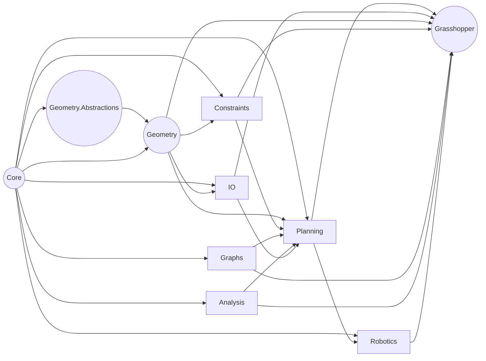

# Module Map & Architecture Overview

## Solution Layout

```text
AssemblyChain-Core.sln
├── src/AssemblyChain/Core
├── src/AssemblyChain/Geometry
├── src/AssemblyChain/Geometry.Abstractions
├── src/AssemblyChain/Constraints
├── src/AssemblyChain/Graphs
├── src/AssemblyChain/Planning
├── src/AssemblyChain/Analysis
├── src/AssemblyChain/IO
├── src/AssemblyChain/Robotics
├── src/AssemblyChain.Grasshopper
├── tests/AssemblyChain.Core.Tests
└── tests/AssemblyChain.Benchmarks
```

## Module Responsibilities

| Project | Layer | Responsibilities | Key Dependencies | Public Surface Highlights |
| --- | --- | --- | --- | --- |
| AssemblyChain.Core | Domain | Core entities, spatial primitives (`Vector3d`, `BoundingBox`), workflow records, event metadata. | Newtonsoft.Json, RhinoCommon | Immutable records, domain services for assembly plans, spatial helpers. |
| AssemblyChain.Geometry.Abstractions | Domain | Shared interfaces for geometry kernels used by Geometry package. | None | Interface types consumed by Geometry. |
| AssemblyChain.Geometry | Domain Services | Mesh preprocessing, contact detection, clustering utilities, tolerance management. | Core, Geometry.Abstractions, RhinoCommon | `Toolkit` static helpers, contact detection pipelines, mesh repair strategies. |
| AssemblyChain.Constraints | Domain Services | Directional cones, stability checks, constraint builders. | Core, Geometry | Constraint models consumed by Planning. |
| AssemblyChain.Graphs | Domain Services | Dependency graph construction, analytics, GNN utilities. | Core, Constraints | Graph primitives and traversal algorithms. |
| AssemblyChain.Analysis | Services | Stability analysis, ONNX inference wrappers. | Core | `IStabilityAnalyzer`, inference utilities. |
| AssemblyChain.IO | Adapters | Serialization contracts, dataset import/export, Grasshopper interop DTOs. | Core | JSON serializers, Rhino object translators. |
| AssemblyChain.Planning | Application | Solver façade, search algorithms (CSP/MILP/SAT), workflow orchestration. | Core, Constraints, Graphs, Analysis, RhinoCommon | `CspSolver`, `MilpSolver`, `WorkflowFacade`. |
| AssemblyChain.Robotics | Application | Robot cell definitions, driver integration stubs. | Core, Planning | Robot command DTOs, simulation adapters. |
| AssemblyChain.Grasshopper | Presentation | Grasshopper components, UI conduits, plugin packaging, native interop. | Core, IO, Geometry, Constraints, Graphs, Planning, Analysis, Robotics, BulletSharp, WaveEngine | Component classes (`AcGh*`), UI helpers, plugin entry point. |

## Dependency Graph



## Boundary Observations

* `AssemblyChain.IO` and `AssemblyChain.Planning` both consume Rhino geometry types, creating tight coupling to RhinoCommon.
* `AssemblyChain.Grasshopper` references all other runtime projects plus bundled native DLLs (`Libs/`).
* Cyclic dependencies exist via shared static helpers inside Geometry and Planning models; consider introducing DTOs and service interfaces to decouple IO ↔ Geometry ↔ Planning.
* Tests reference the Grasshopper plugin directly, increasing fixture load times and requiring Windows-only dependencies.

## Data Flow Snapshot

1. Geometry data enters through IO serializers or Grasshopper components.
2. Geometry utilities preprocess meshes and compute contact zones.
3. Constraints and graph modules derive directional cones and dependency graphs.
4. Planning façade orchestrates solver backends (CSP/MILP/SAT/OR-Tools) to create assembly sequences.
5. Results flow back to IO (for persistence) and Grasshopper UI (for visualisation) and optionally Robotics for downstream execution.

