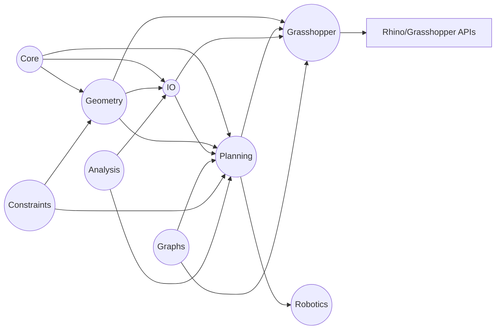

# AssemblyChain Modularity & Architecture Assessment

## Repository Structure Overview

- **Solution:** `AssemblyChain-Core.sln`
- **Projects:**
  - `AssemblyChain.Geometry` – geometry processing, contact detection, and mesh tooling.
  - `AssemblyChain.Grasshopper` – Rhino/Grasshopper UI integration and legacy components.
  - `AssemblyChain.Planning` – planning façade, models, and solver backends (CSP, MILP, SAT, OR-Tools).
  - `AssemblyChain.Core` – domain entities, value objects, spatial helpers, and domain records.
  - `AssemblyChain.IO` – serialization contracts and dataset exporters.
  - `AssemblyChain.Graphs` – graph construction, analytics, and GNN utilities.
  - `AssemblyChain.Analysis` – stability analysis and ONNX inference services.
  - `AssemblyChain.Constraints` – motion constraints, pose estimation, and cone utilities.
  - `AssemblyChain.Robotics` – robotics schemas and services.

### Directory Topology

```text
src
├── AssemblyChain.Analysis
├── AssemblyChain.Constraints
├── AssemblyChain.Core
├── AssemblyChain.Geometry
├── AssemblyChain.Graphs
├── AssemblyChain.Grasshopper
├── AssemblyChain.IO
├── AssemblyChain.Planning
└── AssemblyChain.Robotics
```

## Aggregated Module Metrics

| Project | LOC | SLOC | Methods | Avg. Complexity | Doc Coverage |
| --- | ---:| ---:| ---:| ---:| ---:|
| AssemblyChain.Geometry | 9,261 | 8,075 | 347 | 3.10 | 14.0% |
| AssemblyChain.Grasshopper | 2,765 | 2,405 | 119 | 2.13 | 4.5% |
| AssemblyChain.Planning | 2,034 | 1,801 | 82 | 2.40 | 14.0% |
| AssemblyChain.Core | 1,738 | 1,451 | 70 | 1.67 | 28.0% |
| AssemblyChain.IO | 1,018 | 900 | 42 | 1.71 | 24.9% |
| AssemblyChain.Graphs | 1,011 | 860 | 40 | 2.30 | 16.6% |
| AssemblyChain.Robotics | 331 | 286 | 11 | 2.00 | 28.7% |
| AssemblyChain.Constraints | 302 | 257 | 15 | 2.20 | 13.2% |
| AssemblyChain.Analysis | 156 | 136 | 3 | 3.00 | 14.0% |

*Source: `artifacts/audit/audit_report.json`.*

## Dependency Landscape



### Detected Cycles

- `AssemblyChain.IO.Contracts → AssemblyChain.Geometry.Contact → AssemblyChain.Geometry.Contact.Detection.BroadPhase → AssemblyChain.Planning.Model → AssemblyChain.Geometry.Toolkit.Utils → AssemblyChain.IO.Contracts`.
- `AssemblyChain.Planning.Model → AssemblyChain.Geometry.Toolkit.Utils → AssemblyChain.Planning.Model`.
- `AssemblyChain.IO.Contracts → AssemblyChain.Geometry.Contact → AssemblyChain.Geometry.Contact.Detection.NarrowPhase → AssemblyChain.Geometry.Toolkit.Geometry → AssemblyChain.IO.Contracts` (multiple variants).

## High-Complexity Hotspots

| Method | Complexity | Length | Module |
| --- | ---:| ---:| --- |
| `DrawForeground` | 17 | 75 | `AssemblyChain.Grasshopper/UI/ACDBGConduit.cs` |
| `DetectCoplanarContacts` | 16 | 120 | `AssemblyChain.Geometry/Toolkit/Brep/PlanarOps.cs` |
| `PreprocessMesh` | 16 | 117 | `AssemblyChain.Geometry/Toolkit/Mesh/MeshPreprocessor.cs` |
| `DetectContactsWithIntersectionLines` | 15 | 125 | `AssemblyChain.Geometry/Contact/Detection/NarrowPhase/MeshContactDetector.cs` |
| `DrawForeground` | 15 | 83 | `AssemblyChain.Grasshopper/UI/ACPreviewConduit.cs` |
| `ValidateSettings` | 12 | 20 | `AssemblyChain.Geometry/Toolkit/Utils/Tolerance.cs` |
| `GroupNakedEdgesIntoLoops` | 11 | 79 | `AssemblyChain.Geometry/Toolkit/Mesh/Preprocessing/MeshRepair.cs` |
| `ExtractClauses` | 11 | 50 | `AssemblyChain.Planning/Solver/Backends/OrToolsBackend.cs` |
| `DBSCAN` | 11 | 43 | `AssemblyChain.Geometry/Toolkit/Math/Clustering.cs` |
| `ReduceVertices` | 10 | 76 | `AssemblyChain.Geometry/Toolkit/Mesh/Preprocessing/MeshOptimizer.cs` |

## Documentation & Comment Coverage

- Average documentation density across the repository: **16.8%**.
- `AssemblyChain.Grasshopper` has the lowest coverage (≈4.5%), especially across modern component implementations.
- `AssemblyChain.Core` and `AssemblyChain.Robotics` are comparatively well-documented (≈28%).

## Duplicated Fragments

- Repeated cast logic across all Grasshopper Goo wrappers (`AcGhAssemblyWrapGoo`, `AcGhContactModelGoo`, `AcGhPartWrapGoo`, `AcGhPhysicalPropertyGoo`).
- Identical runtime message conversion helpers repeated in `AcGhCreateAssembly`, `AcGhCreatePart`, and `AcGhContactZones` components.

## Identified Issues

### Critical

1. **Cross-module cyclic dependencies** hinder independent builds and testing (`IO.Contracts ↔ Geometry.Contact ↔ Planning.Model`).
2. **Large, high-complexity geometry processing methods** (`MeshContactDetector`, `PlanarOps`, mesh preprocessing classes) make reasoning and reuse difficult.
3. **Grasshopper UI conduits** combine rendering, state updates, and UI logic inside 75–125 line methods, increasing maintenance risk.

### High

1. **Low documentation coverage** across geometry, Grasshopper, and planning packages complicates onboarding.
2. **Solver backends tightly coupled** to Rhino geometry types, reducing portability and testability.
3. **Duplicated message conversion utilities** across Grasshopper components violate DRY and complicate changes.
4. **Mesh processing utilities share similar algorithms** (repair, optimizer, validator) but lack abstraction for shared workflows.

### Medium

1. **`AssemblyChain.Planning.Model` central hub**: high fan-in (16) and direct Rhino dependency; consider DTO separation.
2. **Insufficient boundary validation** in dataset serialization (minimal guard clauses in `DatasetExporter`).
3. **Parallel utilities** (`ParallelProcessor`) mix concurrency control with logging; more cohesive separation needed.
4. **Performance hotspots** (DBSCAN, mesh operations) executed with quadratic patterns without early exit heuristics.

### Low

1. **Legacy Grasshopper components** remain alongside new ones without clear deprecation strategy.
2. **Inconsistent naming conventions** (e.g., `MeshContactDetector.Testing.cs` inside production namespace).
3. **Sparse unit tests** in repository; integration reliant on external tooling.

## Recommendations

### Architectural

- Break dependency cycles via intermediate DTOs or adapters between IO contracts, geometry detection, and planning models.
- Introduce a dedicated geometry service boundary to encapsulate Rhino-dependent operations from planning/IO layers.
- Define interfaces for solver backends and abstract Rhino geometry types where possible to allow pure-core testing.

### Modularization & Code Quality

- Refactor complex geometry and Grasshopper methods into smaller composable operations (e.g., separate intersection detection stages, conduit rendering steps).
- Consolidate duplicated Grasshopper runtime message helpers into shared base classes or extension methods.
- Extract shared mesh preprocessing routines into strategy classes or pipelines to promote reuse and testing.

### Documentation & Maintainability

- Adopt XML doc comments for public APIs and critical algorithms (geometry contact detection, solver configuration).
- Add architecture decision records (ADRs) covering dependency guidelines and module responsibilities.
- Mark legacy Grasshopper components with `[Obsolete]` attributes and document replacement paths.

### Performance & Reliability

- Profile mesh detection hotspots; evaluate spatial acceleration (BVH) and caching to reduce repeated pairwise checks.
- Optimize clustering (`DBSCAN`) by indexing candidate neighbors or limiting search radius via spatial partitioning.
- Expand automated test coverage: unit tests for core geometry math, integration tests for planning workflows, and regression tests for serialization.
- Enforce CI gates (formatting, static analysis, cyclomatic complexity thresholds) to maintain quality over time.

### Implementation Steps

1. **Phase 1 (Decoupling):** Introduce DTO layer in `AssemblyChain.IO` and refactor geometry/planning modules to consume adapters, removing direct Rhino dependencies where feasible.
2. **Phase 2 (Refactoring):** Split high-complexity methods with unit tests; centralize Grasshopper helpers in shared base components.
3. **Phase 3 (Documentation & Tests):** Establish documentation standards, add XML comments, and bootstrap automated tests for core algorithms and serialization.
4. **Phase 4 (Performance):** Benchmark mesh/contact pipelines, implement caching strategies, and consider parallel or GPU acceleration where appropriate.

