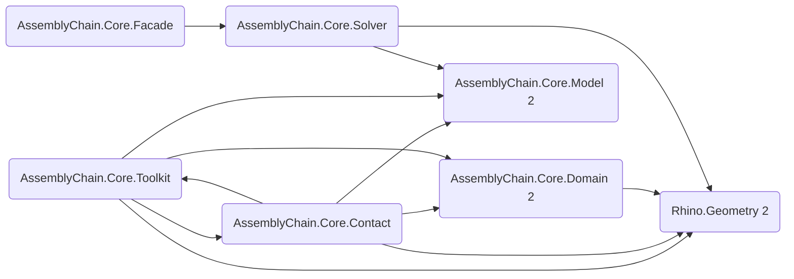

# AssemblyChain 代码库综合分析报告

> 基于 `reports/audit_report.json` 自动生成，覆盖仓库中的 C# 源码文件。

## 1. 目录与模块结构

### 1.1 顶层目录概览

- `.cursor`
- `.github`
- `.vs`
- `.vscode`
- `SAMPLES`
- `docs`
- `reports`
- `samples`
- `scripts`
- `src`
- `tests`
- `tools`

### 1.2 src 目录结构（深度≤3）

```text
src
AssemblyChain.Core
│       ├── Contact
│       │           └── Detection
│       ├── Contracts
│       ├── Data
│       ├── Domain
│       │           ├── Common
│       │           ├── Entities
│       │           ├── Interfaces
│       │           ├── Services
│       │           └── ValueObjects
│       ├── Facade
│       ├── Graph
│       ├── Learning
│       ├── Model
│       ├── Motion
│       ├── Robotics
│       ├── Solver
│       │           └── Backends
│       └── Toolkit
│                   ├── BBox
│                   ├── Brep
│                   ├── Geometry
│                   ├── Intersection
│                   ├── Math
│                   ├── Mesh
│                   └── Utils
AssemblyChain.Grasshopper
        ├── Components
        │           ├── 1_Property
        │           ├── 2_Part
        │           ├── 3_Solver
        │           └── 4_Simulation
        ├── Kernel
        │           ├── Goo
        │           └── Params
        ├── Libs
        ├── Properties
        └── UI
                    ├── Attributes
                    └── Icons
```

### 1.3 tests 目录结构（深度≤2）

```text
tests
AssemblyChain.Benchmarks
AssemblyChain.Core.Tests
        └── Solver
```

## 2. 概览指标

| 指标 | 数值 | 说明 |
| --- | ---: | --- |
| 源文件数 | 108 | 参与分析的 C# 文件 |
| 总有效代码行 | 13794 | 去除空行与注释后的统计 |
| 平均方法复杂度 | 2.77 | McCabe 近似值 |
| 最大方法复杂度 | 22 | 重构优先级参考 |
| 平均文档覆盖率 | 18.1% | XML 注释行 / SLOC |
| 异步方法数 | 6 | Task/async 相关 |

## 3. 模块化与命名空间指标

| 命名空间 | 文件数 | SLOC | 方法数 | 平均复杂度 | 文档覆盖率 | 最复杂方法 | 最大参数数 |
| --- | ---: | ---: | ---: | ---: | ---: | ---: | ---: |
| `AssemblyChain.Gh.Kernel` | 15 | 1296 | 59 | 2.56 | 15.3% | 22 | 4 |
| `AssemblyChain.Core.Toolkit.Utils` | 9 | 1106 | 71 | 2.24 | 40.8% | 12 | 4 |
| `AssemblyChain.Core.Toolkit.Mesh.Preprocessing` | 3 | 1069 | 39 | 4.28 | 20.5% | 11 | 3 |
| `AssemblyChain.Core.Contact.Detection.NarrowPhase` | 5 | 861 | 22 | 3.95 | 72.7% | 15 | 6 |
| `AssemblyChain.Core.Solver.Backends` | 2 | 753 | 30 | 3.43 | 6.7% | 11 | 6 |
| `AssemblyChain.Core.Toolkit.Brep` | 3 | 715 | 22 | 4.86 | 77.3% | 16 | 5 |
| `AssemblyChain.Core.Toolkit.Mesh` | 4 | 699 | 31 | 3.00 | 71.0% | 16 | 4 |
| `AssemblyChain.Core.Graph` | 4 | 681 | 29 | 2.59 | 44.8% | 10 | 4 |
| `AssemblyChain.Core.Toolkit.Math` | 3 | 619 | 44 | 2.70 | 22.7% | 11 | 4 |
| `AssemblyChain.Core.Toolkit.Intersection` | 2 | 585 | 15 | 4.40 | 100.0% | 9 | 5 |
| `AssemblyChain.Core.Toolkit.Geometry` | 2 | 502 | 20 | 2.85 | 90.0% | 7 | 6 |
| `AssemblyChain.Core.Contact` | 5 | 487 | 21 | 2.19 | 57.1% | 5 | 8 |
| `AssemblyChain.Core.Model` | 7 | 481 | 31 | 1.68 | 6.5% | 4 | 10 |
| `AssemblyChain.Gh.Visualization` | 2 | 474 | 13 | 4.54 | 0.0% | 17 | 5 |
| `AssemblyChain.Core.Domain.Entities` | 3 | 471 | 23 | 1.83 | 91.3% | 4 | 2 |
| `AssemblyChain.Core.Contact.Detection.BroadPhase` | 2 | 411 | 14 | 2.57 | 100.0% | 7 | 3 |
| `AssemblyChain.Core.Contracts` | 10 | 388 | 12 | 1.17 | 83.3% | 3 | 5 |
| `AssemblyChain.Core.Domain.Services` | 1 | 256 | 16 | 2.00 | 31.2% | 5 | 3 |
| `AssemblyChain.Core.Toolkit.BBox` | 1 | 254 | 13 | 3.00 | 100.0% | 7 | 3 |
| `AssemblyChain.Core.Solver` | 5 | 248 | 5 | 2.00 | 60.0% | 5 | 4 |

> 注：仅展示 SLOC 前 20 的命名空间，完整数据可在 `reports/audit_report.json` 中获取。

## 4. 关键文件与函数

### 4.1 高复杂度函数 (Top 12)

| 函数 | 所在文件 | 复杂度 | 行数 | 最大嵌套 | 参数数 | 文档 |
| --- | --- | ---: | ---: | ---: | ---: | --- |
| `SolveInstance` (`AssemblyChain.Gh.Kernel`) | `AssemblyChain.Grasshopper/Components/2_Part/AcGhCreatePart.cs` | 22 | 163 | 6 | 1 | ❌ |
| `DrawForeground` (`AssemblyChain.Gh.Visualization`) | `AssemblyChain.Grasshopper/UI/ACDBGConduit.cs` | 17 | 75 | 3 | 1 | ❌ |
| `DetectCoplanarContacts` (`AssemblyChain.Core.Toolkit.Brep`) | `AssemblyChain.Core/Toolkit/Brep/PlanarOps.cs` | 16 | 120 | 5 | 5 | ✅ |
| `PreprocessMesh` (`AssemblyChain.Core.Toolkit.Mesh`) | `AssemblyChain.Core/Toolkit/Mesh/MeshPreprocessor.cs` | 16 | 117 | 4 | 2 | ✅ |
| `DetectContactsWithIntersectionLines` (`AssemblyChain.Core.Contact.Detection.NarrowPhase`) | `AssemblyChain.Core/Contact/Detection/NarrowPhase/MeshContactDetector.cs` | 15 | 125 | 9 | 6 | ✅ |
| `DrawForeground` (`AssemblyChain.Gh.Visualization`) | `AssemblyChain.Grasshopper/UI/ACPreviewConduit.cs` | 15 | 83 | 5 | 1 | ❌ |
| `SolveInstance` (`AssemblyChain.Gh.Kernel`) | `AssemblyChain.Grasshopper/Components/2_Part/AcGhCreateAssembly.cs` | 12 | 92 | 6 | 1 | ❌ |
| `ValidateSettings` (`AssemblyChain.Core.Toolkit.Utils`) | `AssemblyChain.Core/Toolkit/Utils/Tolerance.cs` | 12 | 20 | 2 | 2 | ❌ |
| `SolveInstance` (`AssemblyChain.Gh.Kernel`) | `AssemblyChain.Grasshopper/Components/3_Solver/AcGhContactZones.cs` | 11 | 91 | 4 | 1 | ❌ |
| `GroupNakedEdgesIntoLoops` (`AssemblyChain.Core.Toolkit.Mesh.Preprocessing`) | `AssemblyChain.Core/Toolkit/Mesh/Preprocessing/MeshRepair.cs` | 11 | 79 | 5 | 2 | ❌ |
| `ExtractClauses` (`AssemblyChain.Core.Solver.Backends`) | `AssemblyChain.Core/Solver/Backends/OrToolsBackend.cs` | 11 | 50 | 6 | 1 | ❌ |
| `DBSCAN` (`AssemblyChain.Core.Toolkit.Math`) | `AssemblyChain.Core/Toolkit/Math/Clustering.cs` | 11 | 43 | 6 | 3 | ❌ |

### 4.2 超长函数 (Top 12)

| 函数 | 所在文件 | 行数 | 复杂度 | 最大嵌套 | 参数数 | 文档 |
| --- | --- | ---: | ---: | ---: | ---: | --- |
| `SolveInstance` (`AssemblyChain.Gh.Kernel`) | `AssemblyChain.Grasshopper/Components/2_Part/AcGhCreatePart.cs` | 163 | 22 | 6 | 1 | ❌ |
| `DetectContactsWithIntersectionLines` (`AssemblyChain.Core.Contact.Detection.NarrowPhase`) | `AssemblyChain.Core/Contact/Detection/NarrowPhase/MeshContactDetector.cs` | 125 | 15 | 9 | 6 | ✅ |
| `DetectCoplanarContacts` (`AssemblyChain.Core.Toolkit.Brep`) | `AssemblyChain.Core/Toolkit/Brep/PlanarOps.cs` | 120 | 16 | 5 | 5 | ✅ |
| `PreprocessMesh` (`AssemblyChain.Core.Toolkit.Mesh`) | `AssemblyChain.Core/Toolkit/Mesh/MeshPreprocessor.cs` | 117 | 16 | 4 | 2 | ✅ |
| `SolveInstance` (`AssemblyChain.Gh.Kernel`) | `AssemblyChain.Grasshopper/Components/2_Part/AcGhCreateAssembly.cs` | 92 | 12 | 6 | 1 | ❌ |
| `SolveInstance` (`AssemblyChain.Gh.Kernel`) | `AssemblyChain.Grasshopper/Components/3_Solver/AcGhContactZones.cs` | 91 | 11 | 4 | 1 | ❌ |
| `DetectMeshContactsEnhanced` (`AssemblyChain.Core.Contact.Detection.NarrowPhase`) | `AssemblyChain.Core/Contact/Detection/NarrowPhase/MeshContactDetector.cs` | 86 | 7 | 5 | 3 | ✅ |
| `DrawForeground` (`AssemblyChain.Gh.Visualization`) | `AssemblyChain.Grasshopper/UI/ACPreviewConduit.cs` | 83 | 15 | 5 | 1 | ❌ |
| `ComputeIntersection` (`AssemblyChain.Core.Toolkit.Intersection`) | `AssemblyChain.Core/Toolkit/Intersection/MeshMeshIntersect.cs` | 81 | 9 | 6 | 3 | ✅ |
| `ApplySnapshot` (`AssemblyChain.Gh.Visualization`) | `AssemblyChain.Grasshopper/UI/ACDBGConduit.cs` | 80 | 8 | 3 | 5 | ❌ |
| `GroupNakedEdgesIntoLoops` (`AssemblyChain.Core.Toolkit.Mesh.Preprocessing`) | `AssemblyChain.Core/Toolkit/Mesh/Preprocessing/MeshRepair.cs` | 79 | 11 | 5 | 2 | ❌ |
| `ReduceVertices` (`AssemblyChain.Core.Toolkit.Mesh.Preprocessing`) | `AssemblyChain.Core/Toolkit/Mesh/Preprocessing/MeshOptimizer.cs` | 76 | 10 | 5 | 3 | ❌ |

## 5. 依赖关系分析

### 5.1 主要命名空间依赖图 (Top 12 边)



### 5.2 循环依赖

- AssemblyChain.Core.Contact → AssemblyChain.Core.Contact.Detection.BroadPhase → AssemblyChain.Core.Model → AssemblyChain.Core.Toolkit.Utils → AssemblyChain.Core.Contact
- AssemblyChain.Core.Model → AssemblyChain.Core.Toolkit.Utils → AssemblyChain.Core.Model
- AssemblyChain.Core.Contact → AssemblyChain.Core.Contact.Detection.NarrowPhase → AssemblyChain.Core.Contact
- AssemblyChain.Core.Contact → AssemblyChain.Core.Contact.Detection.NarrowPhase → AssemblyChain.Core.Toolkit.Geometry → AssemblyChain.Core.Contact
- AssemblyChain.Core.Contact → AssemblyChain.Core.Contracts → AssemblyChain.Core.Contact

## 6. 重复与可维护性风险

### 6.1 代码重复片段

| 片段哈希 | 出现次数 | 示例文件 | 上下文预览 |
| --- | ---: | --- | --- |
| `d627e534f5a6822dcd260261ddaba3c3` | 4 | `AssemblyChain.Grasshopper/Kernel/Goo/AcGhAssemblyWrapGoo.cs` | `Value = goo.Value;<br/>return true;<br/>default:<br/>return base.CastFrom(source);<br/>}<br/>}` |
| `043681f4574e0f2b281010a996343df3` | 2 | `AssemblyChain.Core/Toolkit/Geometry/MeshGeometry.cs` | `{<br/>try<br/>{<br/>var vertices = new Point3d[] {<br/>mesh.Vertices[face.A],<br/>mesh.Vertices[face.B],` |
| `10d3aa1e7a17ab905475c591d5cd1136` | 2 | `AssemblyChain.Core/Domain/Entities/Assembly.cs` | `{<br/>bbox = partBbox;<br/>initialized = true;<br/>}<br/>else<br/>{` |
| `138caadaa91be420969f3469a5d0db4c` | 2 | `AssemblyChain.Grasshopper/UI/ACDBGConduit.cs` | `}<br/>}<br/>private void DrawArrow(DrawEventArgs e, Point3d position, Vector3d direction, double size, Color color)<br/>{<br/>var right = Vector3d.CrossProduct(direction, Vector3d.ZAxis);<br/>if (right.IsTiny()) right = Vector3d.CrossProduct(direction, Vector3d.XAxis);` |
| `19e788490313bd573ae81a992fe94455` | 2 | `AssemblyChain.Core/Motion/ConeIntersection.cs` | `{<br/>if (constraintNormals == null || constraintNormals.Count == 0) return true;<br/>foreach (var normal in constraintNormals)<br/>{<br/>var dot = Vector3d.Multiply(direction, normal);<br/>if (dot < -tolerance) return false;` |
| `1f9ff85eddcff65478fd06ca0a87e83e` | 2 | `AssemblyChain.Core/Motion/MotionEvaluator.cs` | `var indices = new int[size];<br/>for (int i = 0; i < size; i++) indices[i] = i;<br/>while (true)<br/>{<br/>yield return indices.Select(i => items[i]).ToArray();<br/>int j = size - 1;` |
| `2025dfb54df62672e9f93aa442780c6e` | 2 | `AssemblyChain.Core/Motion/ConeIntersection.cs` | `public static bool IsDirectionFeasible(Vector3d direction, IReadOnlyList<Vector3d> constraintNormals, double tolerance = 1e-9)<br/>{<br/>if (constraintNormals == null || constraintNormals.Count == 0) return true;<br/>foreach (var normal in constraintNormals)<br/>{<br/>var dot = Vector3d.Multiply(direction, normal);` |
| `20e740e9033602177351e6e23fa6130a` | 2 | `AssemblyChain.Core/Motion/ConeIntersection.cs` | `var vector = point - origin;<br/>return Vector3d.Multiply(vector, normal) >= 0;<br/>}<br/>public static bool IsDirectionFeasible(Vector3d direction, IReadOnlyList<Vector3d> constraintNormals, double tolerance = 1e-9)<br/>{<br/>if (constraintNormals == null || constraintNormals.Count == 0) return true;` |
| `237ba1d28ba8bb7a9b5b59eb2487f94c` | 2 | `AssemblyChain.Core/Toolkit/Geometry/MeshGeometry.cs` | `{<br/>mesh.Vertices[face.A],<br/>mesh.Vertices[face.B],<br/>mesh.Vertices[face.C]<br/>};<br/>if (face.IsQuad)` |
| `25a54add87bd8bd5a14715fc4f8da8bb` | 2 | `AssemblyChain.Core/Motion/ConeIntersection.cs` | `return Vector3d.Multiply(vector, normal) >= 0;<br/>}<br/>public static bool IsDirectionFeasible(Vector3d direction, IReadOnlyList<Vector3d> constraintNormals, double tolerance = 1e-9)<br/>{<br/>if (constraintNormals == null || constraintNormals.Count == 0) return true;<br/>foreach (var normal in constraintNormals)` |

## 7. 问题清单

### 7.1 严重级别 P0

- **CyclicDependency**：Cyclic namespace dependency detected: AssemblyChain.Core.Contact → AssemblyChain.Core.Contact.Detection.BroadPhase → AssemblyChain.Core.Model → AssemblyChain.Core.Toolkit.Utils → AssemblyChain.Core.Contact
- **CyclicDependency**：Cyclic namespace dependency detected: AssemblyChain.Core.Model → AssemblyChain.Core.Toolkit.Utils → AssemblyChain.Core.Model
- **CyclicDependency**：Cyclic namespace dependency detected: AssemblyChain.Core.Contact → AssemblyChain.Core.Contact.Detection.NarrowPhase → AssemblyChain.Core.Contact
- **CyclicDependency**：Cyclic namespace dependency detected: AssemblyChain.Core.Contact → AssemblyChain.Core.Contact.Detection.NarrowPhase → AssemblyChain.Core.Toolkit.Geometry → AssemblyChain.Core.Contact
- **CyclicDependency**：Cyclic namespace dependency detected: AssemblyChain.Core.Contact → AssemblyChain.Core.Contracts → AssemblyChain.Core.Contact
- **ExtremeComplexity**：AssemblyChain.Grasshopper/Components/2_Part/AcGhCreatePart.cs:SolveInstance complexity 22.

### 7.2 严重级别 P1

- **Duplication**：Detected 50 duplicated fragments across modules.
- **HighComplexity**：AssemblyChain.Core/Contact/Detection/NarrowPhase/MeshContactDetector.cs:DetectContactsWithIntersectionLines complexity 15.
- **HighComplexity**：AssemblyChain.Core/Toolkit/Brep/PlanarOps.cs:DetectCoplanarContacts complexity 16.
- **HighComplexity**：AssemblyChain.Core/Toolkit/Mesh/MeshPreprocessor.cs:PreprocessMesh complexity 16.
- **HighComplexity**：AssemblyChain.Core/Toolkit/Utils/Tolerance.cs:ValidateSettings complexity 12.
- **HighComplexity**：AssemblyChain.Grasshopper/Components/2_Part/AcGhCreateAssembly.cs:SolveInstance complexity 12.
- **HighComplexity**：AssemblyChain.Grasshopper/UI/ACDBGConduit.cs:DrawForeground complexity 17.
- **HighComplexity**：AssemblyChain.Grasshopper/UI/ACPreviewConduit.cs:DrawForeground complexity 15.
- **HighCoupling**：`AssemblyChain.Gh.Kernel` has fan-out 10; consider splitting responsibilities.
- **LargeFile**：AssemblyChain.Core/Contact/Detection/NarrowPhase/MeshContactDetector.cs exceeds 600 LOC (679 LOC).
- **LargeFile**：AssemblyChain.Core/Solver/Backends/OrToolsBackend.cs exceeds 600 LOC (760 LOC).
- **LongMethod**：AssemblyChain.Core/Contact/Detection/NarrowPhase/MeshContactDetector.cs:DetectContactsWithIntersectionLines spans 125 lines.
- **LongMethod**：AssemblyChain.Core/Toolkit/Brep/PlanarOps.cs:DetectCoplanarContacts spans 120 lines.
- **LongMethod**：AssemblyChain.Grasshopper/Components/2_Part/AcGhCreatePart.cs:SolveInstance spans 163 lines.
- **SharedHotspot**：`AssemblyChain.Core.Contact` is a dependency hotspot with fan-in 10.
- **SharedHotspot**：`AssemblyChain.Core.Domain.Entities` is a dependency hotspot with fan-in 11.
- **SharedHotspot**：`AssemblyChain.Core.Model` is a dependency hotspot with fan-in 16.

### 7.3 严重级别 P2

- **LongMethod**：AssemblyChain.Core/Contact/Detection/NarrowPhase/MeshContactDetector.cs:DetectMeshContactsEnhanced spans 86 lines.
- **LongMethod**：AssemblyChain.Core/Toolkit/Intersection/MeshMeshIntersect.cs:ComputeIntersection spans 81 lines.
- **LongMethod**：AssemblyChain.Core/Toolkit/Mesh/MeshPreprocessor.cs:PreprocessMesh spans 117 lines.
- **LongMethod**：AssemblyChain.Grasshopper/Components/2_Part/AcGhCreateAssembly.cs:SolveInstance spans 92 lines.
- **LongMethod**：AssemblyChain.Grasshopper/Components/3_Solver/AcGhContactZones.cs:SolveInstance spans 91 lines.
- **LongMethod**：AssemblyChain.Grasshopper/UI/ACDBGConduit.cs:ApplySnapshot spans 80 lines.
- **LongMethod**：AssemblyChain.Grasshopper/UI/ACPreviewConduit.cs:DrawForeground spans 83 lines.
- **LongParameterList**：AssemblyChain.Core/Contact/ContactModel.cs:ContactData defines 8 parameters.
- **LongParameterList**：AssemblyChain.Core/Contact/Detection/NarrowPhase/MeshContactDetector.cs:DetectContactsWithTightInclusion defines 6 parameters.
- **LongParameterList**：AssemblyChain.Core/Contact/Detection/NarrowPhase/MeshContactDetector.cs:DetectContactsWithIntersectionLines defines 6 parameters.
- **LongParameterList**：AssemblyChain.Core/Contact/Detection/NarrowPhase/MeshContactDetector.cs:DetectContactsWithSimpleOverlap defines 6 parameters.
- **LongParameterList**：AssemblyChain.Core/Contact/Detection/NarrowPhase/MeshContactDetector.cs:ComputeEdgeContacts defines 6 parameters.
- **LongParameterList**：AssemblyChain.Core/Contact/Detection/NarrowPhase/NarrowPhaseDetection.cs:DetectContactsForPair defines 6 parameters.
- **LongParameterList**：AssemblyChain.Core/Domain/ValueObjects/MaterialProperties.cs:MaterialProperties defines 9 parameters.
- **LongParameterList**：AssemblyChain.Core/Model/GraphModel.cs:GraphModel defines 6 parameters.
- **LongParameterList**：AssemblyChain.Core/Model/SolverModel.cs:DgSolverModel defines 10 parameters.
- **LongParameterList**：AssemblyChain.Core/Solver/Backends/ISolverBackend.cs:SolverBackendResult defines 6 parameters.
- **LongParameterList**：AssemblyChain.Core/Toolkit/Geometry/PlaneOperations.cs:ComputeFaceIntersectionGeometry defines 6 parameters.
- **LowDocumentation**：AssemblyChain.Core/Solver/Backends/OrToolsBackend.cs has sparse XML documentation (1.2%).
- **LowDocumentation**：AssemblyChain.Core/Toolkit/Math/Clustering.cs has sparse XML documentation (0.9%).
- **LowDocumentation**：AssemblyChain.Core/Toolkit/Mesh/MeshPreprocessor.cs has sparse XML documentation (4.5%).
- **LowDocumentation**：AssemblyChain.Core/Toolkit/Mesh/Preprocessing/MeshOptimizer.cs has sparse XML documentation (4.6%).
- **LowDocumentation**：AssemblyChain.Core/Toolkit/Mesh/Preprocessing/MeshRepair.cs has sparse XML documentation (3.3%).
- **LowDocumentation**：AssemblyChain.Core/Toolkit/Utils/JsonSerializer.cs has sparse XML documentation (1.1%).
- **LowDocumentation**：AssemblyChain.Grasshopper/Components/2_Part/AcGhCreatePart.cs has sparse XML documentation (2.0%).
- **LowDocumentation**：AssemblyChain.Grasshopper/UI/ACDBGConduit.cs has sparse XML documentation (0.0%).
- **UndocumentedMethod**：AssemblyChain.Core/Contact/ContactModel.cs:ContactModel lacks XML documentation.
- **UndocumentedMethod**：AssemblyChain.Core/Contact/Detection/NarrowPhase/MeshContactDetector.cs:CreatePreset lacks XML documentation.
- **UndocumentedMethod**：AssemblyChain.Core/Contact/Detection/NarrowPhase/MeshContactDetector.cs:ValidateAndFilterContacts lacks XML documentation.
- **UndocumentedMethod**：AssemblyChain.Core/Graph/ConstraintGraphBuilder.cs:BuildPartConstraints lacks XML documentation.
- **UndocumentedMethod**：AssemblyChain.Core/Graph/ConstraintGraphBuilder.cs:BuildGroupConstraints lacks XML documentation.
- **UndocumentedMethod**：AssemblyChain.Core/Model/AssemblyModel.cs:AssemblyModel lacks XML documentation.
- **UndocumentedMethod**：AssemblyChain.Core/Model/SolverModel.cs:ToAssemblySequence lacks XML documentation.
- **UndocumentedMethod**：AssemblyChain.Core/Solver/Backends/OrToolsBackend.cs:SolveSat lacks XML documentation.
- **UndocumentedMethod**：AssemblyChain.Core/Solver/Backends/OrToolsBackend.cs:TrySelectMotionVector lacks XML documentation.
- **UndocumentedMethod**：AssemblyChain.Core/Solver/Backends/OrToolsBackend.cs:ApplyDeclarativeConstraints lacks XML documentation.
- **UndocumentedMethod**：AssemblyChain.Core/Solver/Backends/OrToolsBackend.cs:ExtractClauses lacks XML documentation.
- **UndocumentedMethod**：AssemblyChain.Core/Solver/Backends/OrToolsBackend.cs:SolveBooleanAssignment lacks XML documentation.
- **UndocumentedMethod**：AssemblyChain.Core/Solver/Backends/OrToolsBackend.cs:SatisfiesClauses lacks XML documentation.
- **UndocumentedMethod**：AssemblyChain.Core/Solver/Backends/OrToolsBackend.cs:ResolveOrder lacks XML documentation.
- **UndocumentedMethod**：AssemblyChain.Core/Solver/BaseSolver.cs:MapToModel lacks XML documentation.
- **UndocumentedMethod**：AssemblyChain.Core/Toolkit/Math/Clustering.cs:KMeans lacks XML documentation.
- **UndocumentedMethod**：AssemblyChain.Core/Toolkit/Math/Clustering.cs:InitializeKMeansPlusPlus lacks XML documentation.
- **UndocumentedMethod**：AssemblyChain.Core/Toolkit/Math/Clustering.cs:DBSCAN lacks XML documentation.
- **UndocumentedMethod**：AssemblyChain.Core/Toolkit/Mesh/Preprocessing/MeshOptimizer.cs:ReduceVertices lacks XML documentation.
- **UndocumentedMethod**：AssemblyChain.Core/Toolkit/Mesh/Preprocessing/MeshOptimizer.cs:SmoothMesh lacks XML documentation.
- **UndocumentedMethod**：AssemblyChain.Core/Toolkit/Mesh/Preprocessing/MeshOptimizer.cs:CalculateFaceArea lacks XML documentation.
- **UndocumentedMethod**：AssemblyChain.Core/Toolkit/Mesh/Preprocessing/MeshRepair.cs:FillMeshHoles lacks XML documentation.
- **UndocumentedMethod**：AssemblyChain.Core/Toolkit/Mesh/Preprocessing/MeshRepair.cs:RemoveDuplicateFaces lacks XML documentation.
- **UndocumentedMethod**：AssemblyChain.Core/Toolkit/Mesh/Preprocessing/MeshRepair.cs:GroupNakedEdgesIntoLoops lacks XML documentation.
- **UndocumentedMethod**：AssemblyChain.Core/Toolkit/Mesh/Preprocessing/MeshRepair.cs:TryFillHole lacks XML documentation.
- **UndocumentedMethod**：AssemblyChain.Core/Toolkit/Mesh/Preprocessing/MeshValidator.cs:CheckDegenerateFaces lacks XML documentation.
- **UndocumentedMethod**：AssemblyChain.Core/Toolkit/Mesh/Preprocessing/MeshValidator.cs:CheckNormals lacks XML documentation.
- **UndocumentedMethod**：AssemblyChain.Core/Toolkit/Mesh/Preprocessing/MeshValidator.cs:CheckBoundingBox lacks XML documentation.
- **UndocumentedMethod**：AssemblyChain.Core/Toolkit/Mesh/Preprocessing/MeshValidator.cs:IsDegenerateFace lacks XML documentation.
- **UndocumentedMethod**：AssemblyChain.Core/Toolkit/Utils/ExtremeRayExtractor.cs:SampleRaysEvenly lacks XML documentation.
- **UndocumentedMethod**：AssemblyChain.Core/Toolkit/Utils/JsonSerializer.cs:Serialize lacks XML documentation.
- **UndocumentedMethod**：AssemblyChain.Grasshopper/Components/1_Property/AcGhDefinePhysicalProperty.cs:SolveInstance lacks XML documentation.
- **UndocumentedMethod**：AssemblyChain.Grasshopper/Components/2_Part/AcGhCreateAssembly.cs:SolveInstance lacks XML documentation.
- **UndocumentedMethod**：AssemblyChain.Grasshopper/Components/2_Part/AcGhCreatePart.cs:SolveInstance lacks XML documentation.
- **UndocumentedMethod**：AssemblyChain.Grasshopper/Components/2_Part/AcGhCreatePart.cs:VariableParameterMaintenance lacks XML documentation.
- **UndocumentedMethod**：AssemblyChain.Grasshopper/Components/2_Part/AcGhCreatePart.cs:UpdateInputParameters lacks XML documentation.
- **UndocumentedMethod**：AssemblyChain.Grasshopper/Components/2_Part/AcGhCreatePart.cs:AppendAdditionalComponentMenuItems lacks XML documentation.
- **UndocumentedMethod**：AssemblyChain.Grasshopper/Components/3_Solver/AcGhBuildContactModel.cs:SolveInstance lacks XML documentation.
- **UndocumentedMethod**：AssemblyChain.Grasshopper/Components/3_Solver/AcGhContactZones.cs:SolveInstance lacks XML documentation.
- **UndocumentedMethod**：AssemblyChain.Grasshopper/UI/ACDBGConduit.cs:ApplySnapshot lacks XML documentation.
- **UndocumentedMethod**：AssemblyChain.Grasshopper/UI/ACDBGConduit.cs:DrawForeground lacks XML documentation.
- **UndocumentedMethod**：AssemblyChain.Grasshopper/UI/ACPreviewConduit.cs:DrawForeground lacks XML documentation.

## 8. 建议与下一步

### 8.1 Architecture 层面

- Break cyclic namespace dependencies via inversion (interfaces) or mediator services and enforce one-way references.
- Introduce façade services around shared hotspots to reduce direct dependencies and protect domain boundaries.
- Review high fan-out namespaces and split responsibilities into cohesive modules with explicit APIs.

### 8.2 Module 层面

- Decompose oversized files into focused classes following single-responsibility principles.
- Factor repeated fragments into shared utilities or generics to eliminate duplication across modules.

### 8.3 Function 层面

- Introduce parameter objects or configuration records to shrink long parameter lists.
- Refactor high-complexity methods using guard clauses, extraction, and descriptive helpers to flatten nesting.
- Split long methods around distinct responsibilities and favour pipelines or smaller private helpers.

### 8.4 Engineering 层面

- Add regression tests around identified hotspots before refactoring to protect behaviour.
- Automate this audit via CI to monitor metric drift and enforce agreed quality gates.
- Raise documentation coverage by requiring XML summaries for public APIs and critical workflows.
