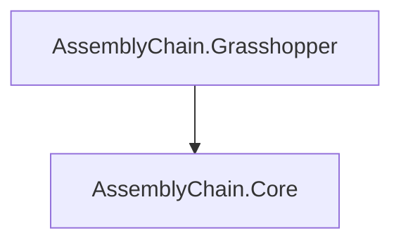

# AssemblyChain Source Analysis Report

Generated automatically by `scripts/generate_src_report.py`.

## Summary Metrics

- **Source files analyzed:** 108
- **Total effective lines of code:** 10656
- **Methods discovered:** 555
- **Average XML doc coverage:** 18.1%
- **Average method LOC:** 8.8
- **Average method complexity (heuristic):** 3.2
- **High severity issues flagged:** 19

## Directory Structure

```
src
├── AssemblyChain.Core
│   ├── Contact
│   │   ├── Detection
│   │   │   ├── BroadPhase
│   │   │   │   ├── RTreeBroadPhase.cs
│   │   │   │   └── SweepAndPrune.cs
│   │   │   ├── NarrowPhase
│   │   │   │   ├── BrepContactDetector.cs
│   │   │   │   ├── MeshContactDetector.cs
│   │   │   │   ├── MeshContactDetector.Testing.cs
│   │   │   │   ├── MixedGeoContactDetector.cs
│   │   │   │   └── NarrowPhaseDetection.cs
│   │   │   ├── ContactDetection.cs
│   │   │   └── DetectionOptions.cs
│   │   ├── ContactGraphBuilder.cs
│   │   ├── ContactModel.cs
│   │   └── ContactUtils.cs
│   ├── Contracts
│   │   ├── AssemblyPlanRequest.cs
│   │   ├── AssemblyPlanResult.cs
│   │   ├── ContactZone.cs
│   │   ├── DatasetExportOptions.cs
│   │   ├── DatasetExportResult.cs
│   │   ├── IContactUtils.cs
│   │   ├── NarrowPhaseResult.cs
│   │   ├── OnnxInferenceRequest.cs
│   │   ├── OnnxInferenceResult.cs
│   │   └── ProcessExportOptions.cs
│   ├── Data
│   │   └── DatasetExporter.cs
│   ├── Domain
│   │   ├── Common
│   │   │   ├── Entity.cs
│   │   │   └── ValueObject.cs
│   │   ├── Entities
│   │   │   ├── Assembly.cs
│   │   │   ├── Joint.cs
│   │   │   └── Part.cs
│   │   ├── Interfaces
│   │   │   ├── IAssemblyService.cs
│   │   │   └── IPartRepository.cs
│   │   ├── Services
│   │   │   └── DomainServices.cs
│   │   └── ValueObjects
│   │       ├── MaterialProperties.cs
│   │       ├── PartGeometry.cs
│   │       └── PhysicsProperties.cs
│   ├── Facade
│   │   └── AssemblyChainFacade.cs
│   ├── Graph
│   │   ├── ConstraintGraphBuilder.cs
│   │   ├── GNNAnalyzer.cs
│   │   ├── GraphOptions.cs
│   │   └── GraphViews.cs
│   ├── Learning
│   │   └── OnnxInferenceService.cs
│   ├── Model
│   │   ├── AssemblyModel.cs
│   │   ├── AssemblyModelFactory.cs
│   │   ├── ConstraintModel.cs
│   │   ├── ConstraintModelFactory.cs
│   │   ├── GraphModel.cs
│   │   ├── MotionModel.cs
│   │   └── SolverModel.cs
│   ├── Motion
│   │   ├── ConeIntersection.cs
│   │   ├── MotionEvaluator.cs
│   │   ├── MotionOptions.cs
│   │   ├── PoseEstimator.cs
│   │   └── PoseTypes.cs
│   ├── Robotics
│   │   ├── process.schema.json
│   │   └── ProcessSchema.cs
│   ├── Solver
│   │   ├── Backends
│   │   │   ├── ISolverBackend.cs
│   │   │   └── OrToolsBackend.cs
│   │   ├── BaseSolver.cs
│   │   ├── CSPSolver.cs
│   │   ├── MILPSolver.cs
│   │   ├── SATSolver.cs
│   │   └── SolverOptions.cs
│   ├── Toolkit
│   │   ├── BBox
│   │   │   └── BoundingHelpers.cs
│   │   ├── Brep
│   │   │   ├── BrepUtilities.cs
│   │   │   ├── PlanarOps.cs
│   │   │   └── PlanarOps.Types.cs
│   │   ├── Geometry
│   │   │   ├── MeshGeometry.cs
│   │   │   └── PlaneOperations.cs
│   │   ├── Intersection
│   │   │   ├── BrepBrepIntersect.cs
│   │   │   └── MeshMeshIntersect.cs
│   │   ├── Math
│   │   │   ├── Clustering.cs
│   │   │   ├── ConvexCone.cs
│   │   │   └── LinearAlgebra.cs
│   │   ├── Mesh
│   │   │   ├── Preprocessing
│   │   │   │   ├── MeshOptimizer.cs
│   │   │   │   ├── MeshRepair.cs
│   │   │   │   └── MeshValidator.cs
│   │   │   ├── MeshPreprocessor.cs
│   │   │   ├── MeshPreprocessor.Types.cs
│   │   │   ├── MeshSpatialIndex.cs
│   │   │   └── MeshToBrep.cs
│   │   └── Utils
│   │       ├── CacheManager.cs
│   │       ├── ContactDetectionHelpers.cs
│   │       ├── ExtremeRayExtractor.cs
│   │       ├── GroupCandidates.cs
│   │       ├── HalfspaceCone.cs
│   │       ├── Hashing.cs
│   │       ├── JsonSerializer.cs
│   │       ├── ParallelProcessor.cs
│   │       ├── PerformanceMonitor.cs
│   │       └── Tolerance.cs
│   └── AssemblyChain.Core.csproj
└── AssemblyChain.Grasshopper
    ├── Components
    │   ├── 1_Property
    │   │   └── AcGhDefinePhysicalProperty.cs
    │   ├── 2_Part
    │   │   ├── AcGhCreateAssembly.cs
    │   │   └── AcGhCreatePart.cs
    │   ├── 3_Solver
    │   │   ├── AcGhBuildContactModel.cs
    │   │   └── AcGhContactZones.cs
    │   └── 4_Simulation
    │       └── Physics
    │           ├── BulletPhysics.cs.back
    │           └── CreateGround.cs.back
    ├── Kernel
    │   ├── Goo
    │   │   ├── AcGhAssemblyWrapGoo.cs
    │   │   ├── AcGhContactModelGoo.cs
    │   │   ├── AcGhGooBase.cs
    │   │   ├── AcGhPartWrapGoo.cs
    │   │   └── AcGhPhysicalPropertyGoo.cs
    │   └── Params
    │       ├── AcGhAssemblyWrapParam.cs
    │       ├── AcGhContactModelParam.cs
    │       ├── AcGhParamBase.cs
    │       ├── AcGhPartWrapParam.cs
    │       └── AcGhPhysicalPropertyParam.cs
    ├── Libs
    │   ├── BulletSharpPInvoke.dll
    │   ├── libbulletc.dll
    │   ├── WaveEngine.Common.dll
    │   ├── WaveEngine.Mathematics.dll
    │   └── WaveEngine.Yaml.dll
    ├── Properties
    │   ├── AssemblyInfo.cs
    │   └── launchSettings.json
    ├── UI
    │   ├── Attributes
    │   │   └── ComponentButton.cs
    │   ├── Icons
    │   │   └── DDU LOGO_WhiteTEXT.png
    │   ├── ACDBGConduit.cs
    │   ├── ACPreviewConduit.cs
    │   └── ComponentForm.cs
    ├── AssemblyChain.Gh.csproj
    └── AssemblyChain.Gh.csproj.user
```

## Project Dependency Graph



## File-Level Metrics

| File | LOC | Code | Comments | Classes | Structs | Interfaces | Enums | Methods | Doc% |
| --- | --- | --- | --- | --- | --- | --- | --- | --- | --- |
| `src/AssemblyChain.Core/Contact/ContactGraphBuilder.cs` | 96 | 76 | 7 | 0 | 0 | 0 | 0 | 4 | 6.2% |
| `src/AssemblyChain.Core/Contact/ContactModel.cs` | 235 | 131 | 72 | 0 | 0 | 0 | 0 | 13 | 29.4% |
| `src/AssemblyChain.Core/Contact/ContactUtils.cs` | 69 | 56 | 6 | 0 | 0 | 0 | 0 | 2 | 5.8% |
| `src/AssemblyChain.Core/Contact/Detection/BroadPhase/RTreeBroadPhase.cs` | 202 | 133 | 37 | 0 | 0 | 0 | 0 | 7 | 15.3% |
| `src/AssemblyChain.Core/Contact/Detection/BroadPhase/SweepAndPrune.cs` | 274 | 178 | 63 | 0 | 0 | 0 | 0 | 10 | 19.0% |
| `src/AssemblyChain.Core/Contact/Detection/ContactDetection.cs` | 116 | 79 | 16 | 0 | 0 | 0 | 0 | 2 | 7.8% |
| `src/AssemblyChain.Core/Contact/Detection/DetectionOptions.cs` | 50 | 34 | 10 | 0 | 0 | 0 | 0 | 0 | 12.0% |
| `src/AssemblyChain.Core/Contact/Detection/NarrowPhase/BrepContactDetector.cs` | 58 | 40 | 9 | 0 | 0 | 0 | 0 | 1 | 10.3% |
| `src/AssemblyChain.Core/Contact/Detection/NarrowPhase/MeshContactDetector.Testing.cs` | 88 | 61 | 15 | 0 | 0 | 0 | 0 | 3 | 17.0% |
| `src/AssemblyChain.Core/Contact/Detection/NarrowPhase/MeshContactDetector.cs` | 679 | 505 | 63 | 0 | 0 | 0 | 0 | 13 | 5.9% |
| `src/AssemblyChain.Core/Contact/Detection/NarrowPhase/MixedGeoContactDetector.cs` | 117 | 86 | 16 | 0 | 0 | 0 | 0 | 2 | 7.7% |
| `src/AssemblyChain.Core/Contact/Detection/NarrowPhase/NarrowPhaseDetection.cs` | 78 | 56 | 10 | 0 | 0 | 0 | 0 | 2 | 7.7% |
| `src/AssemblyChain.Core/Contracts/AssemblyPlanRequest.cs` | 60 | 28 | 26 | 0 | 0 | 0 | 0 | 1 | 43.3% |
| `src/AssemblyChain.Core/Contracts/AssemblyPlanResult.cs` | 33 | 16 | 14 | 0 | 0 | 0 | 0 | 1 | 42.4% |
| `src/AssemblyChain.Core/Contracts/ContactZone.cs` | 53 | 22 | 25 | 0 | 0 | 0 | 0 | 2 | 43.4% |
| `src/AssemblyChain.Core/Contracts/DatasetExportOptions.cs` | 25 | 10 | 12 | 0 | 0 | 0 | 0 | 0 | 48.0% |
| `src/AssemblyChain.Core/Contracts/DatasetExportResult.cs` | 29 | 13 | 14 | 0 | 0 | 0 | 0 | 1 | 48.3% |
| `src/AssemblyChain.Core/Contracts/IContactUtils.cs` | 27 | 13 | 13 | 0 | 0 | 0 | 0 | 0 | 40.7% |
| `src/AssemblyChain.Core/Contracts/NarrowPhaseResult.cs` | 116 | 72 | 33 | 0 | 0 | 0 | 0 | 5 | 26.7% |
| `src/AssemblyChain.Core/Contracts/OnnxInferenceRequest.cs` | 32 | 15 | 14 | 0 | 0 | 0 | 0 | 1 | 43.8% |
| `src/AssemblyChain.Core/Contracts/OnnxInferenceResult.cs` | 24 | 12 | 10 | 0 | 0 | 0 | 0 | 1 | 41.7% |
| `src/AssemblyChain.Core/Contracts/ProcessExportOptions.cs` | 30 | 11 | 15 | 0 | 0 | 0 | 0 | 0 | 50.0% |
| `src/AssemblyChain.Core/Data/DatasetExporter.cs` | 109 | 78 | 11 | 0 | 0 | 0 | 0 | 1 | 10.1% |
| `src/AssemblyChain.Core/Domain/Common/Entity.cs` | 49 | 32 | 6 | 0 | 0 | 0 | 0 | 3 | 12.2% |
| `src/AssemblyChain.Core/Domain/Common/ValueObject.cs` | 56 | 39 | 3 | 0 | 0 | 0 | 0 | 2 | 5.4% |
| `src/AssemblyChain.Core/Domain/Entities/Assembly.cs` | 238 | 134 | 68 | 0 | 0 | 0 | 0 | 12 | 26.5% |
| `src/AssemblyChain.Core/Domain/Entities/Joint.cs` | 145 | 70 | 51 | 0 | 0 | 0 | 0 | 5 | 35.2% |
| `src/AssemblyChain.Core/Domain/Entities/Part.cs` | 174 | 84 | 64 | 0 | 0 | 0 | 0 | 6 | 36.2% |
| `src/AssemblyChain.Core/Domain/Interfaces/IAssemblyService.cs` | 81 | 38 | 33 | 0 | 0 | 0 | 0 | 0 | 40.7% |
| `src/AssemblyChain.Core/Domain/Interfaces/IPartRepository.cs` | 57 | 18 | 30 | 0 | 0 | 0 | 0 | 0 | 52.6% |
| `src/AssemblyChain.Core/Domain/Services/DomainServices.cs` | 303 | 207 | 49 | 0 | 0 | 0 | 0 | 16 | 10.9% |
| `src/AssemblyChain.Core/Domain/ValueObjects/MaterialProperties.cs` | 93 | 48 | 31 | 0 | 0 | 0 | 0 | 2 | 32.3% |
| `src/AssemblyChain.Core/Domain/ValueObjects/PartGeometry.cs` | 89 | 43 | 33 | 0 | 0 | 0 | 0 | 3 | 37.1% |
| `src/AssemblyChain.Core/Domain/ValueObjects/PhysicsProperties.cs` | 61 | 33 | 18 | 0 | 0 | 0 | 0 | 2 | 29.5% |
| `src/AssemblyChain.Core/Facade/AssemblyChainFacade.cs` | 133 | 89 | 29 | 0 | 0 | 0 | 0 | 8 | 21.8% |
| `src/AssemblyChain.Core/Graph/ConstraintGraphBuilder.cs` | 139 | 95 | 18 | 0 | 0 | 0 | 0 | 4 | 4.3% |
| `src/AssemblyChain.Core/Graph/GNNAnalyzer.cs` | 583 | 400 | 94 | 0 | 0 | 0 | 0 | 17 | 9.4% |
| `src/AssemblyChain.Core/Graph/GraphOptions.cs` | 14 | 9 | 3 | 0 | 0 | 0 | 0 | 0 | 21.4% |
| `src/AssemblyChain.Core/Graph/GraphViews.cs` | 76 | 59 | 3 | 0 | 0 | 0 | 0 | 10 | 0.0% |
| `src/AssemblyChain.Core/Learning/OnnxInferenceService.cs` | 44 | 30 | 9 | 0 | 0 | 0 | 0 | 1 | 20.5% |
| `src/AssemblyChain.Core/Model/AssemblyModel.cs` | 86 | 46 | 27 | 0 | 0 | 0 | 0 | 1 | 29.1% |
| `src/AssemblyChain.Core/Model/AssemblyModelFactory.cs` | 42 | 30 | 9 | 0 | 0 | 0 | 0 | 2 | 21.4% |
| `src/AssemblyChain.Core/Model/ConstraintModel.cs` | 72 | 58 | 4 | 0 | 0 | 0 | 0 | 6 | 5.6% |
| `src/AssemblyChain.Core/Model/ConstraintModelFactory.cs` | 50 | 37 | 8 | 0 | 0 | 0 | 0 | 1 | 16.0% |
| `src/AssemblyChain.Core/Model/GraphModel.cs` | 82 | 68 | 5 | 0 | 0 | 0 | 0 | 7 | 4.9% |
| `src/AssemblyChain.Core/Model/MotionModel.cs` | 86 | 68 | 4 | 0 | 0 | 0 | 0 | 8 | 4.7% |
| `src/AssemblyChain.Core/Model/SolverModel.cs` | 131 | 112 | 5 | 0 | 0 | 0 | 0 | 6 | 3.1% |
| `src/AssemblyChain.Core/Motion/ConeIntersection.cs` | 58 | 35 | 16 | 0 | 0 | 0 | 0 | 4 | 25.9% |
| `src/AssemblyChain.Core/Motion/MotionEvaluator.cs` | 123 | 92 | 9 | 0 | 0 | 0 | 0 | 6 | 4.9% |
| `src/AssemblyChain.Core/Motion/MotionOptions.cs` | 15 | 10 | 3 | 0 | 0 | 0 | 0 | 0 | 20.0% |
| `src/AssemblyChain.Core/Motion/PoseEstimator.cs` | 26 | 22 | 0 | 0 | 0 | 0 | 0 | 2 | 0.0% |
| `src/AssemblyChain.Core/Motion/PoseTypes.cs` | 16 | 14 | 0 | 0 | 0 | 0 | 0 | 1 | 0.0% |
| `src/AssemblyChain.Core/Robotics/ProcessSchema.cs` | 225 | 126 | 70 | 0 | 0 | 0 | 0 | 5 | 31.1% |
| `src/AssemblyChain.Core/Solver/Backends/ISolverBackend.cs` | 100 | 46 | 44 | 0 | 0 | 0 | 0 | 1 | 42.0% |
| `src/AssemblyChain.Core/Solver/Backends/OrToolsBackend.cs` | 45 | 33 | 8 | 0 | 0 | 0 | 0 | 1 | 8.9% |
| `src/AssemblyChain.Core/Solver/BaseSolver.cs` | 140 | 106 | 20 | 0 | 0 | 0 | 0 | 5 | 12.9% |
| `src/AssemblyChain.Core/Solver/CSPSolver.cs` | 33 | 17 | 15 | 0 | 0 | 0 | 0 | 0 | 39.4% |
| `src/AssemblyChain.Core/Solver/MILPSolver.cs` | 34 | 17 | 15 | 0 | 0 | 0 | 0 | 0 | 38.2% |
| `src/AssemblyChain.Core/Solver/SATSolver.cs` | 34 | 17 | 15 | 0 | 0 | 0 | 0 | 0 | 38.2% |
| `src/AssemblyChain.Core/Solver/SolverOptions.cs` | 29 | 20 | 6 | 0 | 0 | 0 | 0 | 0 | 20.7% |
| `src/AssemblyChain.Core/Toolkit/BBox/BoundingHelpers.cs` | 287 | 204 | 50 | 0 | 0 | 0 | 0 | 13 | 16.7% |
| `src/AssemblyChain.Core/Toolkit/Brep/BrepUtilities.cs` | 302 | 200 | 59 | 0 | 0 | 0 | 0 | 10 | 12.9% |
| `src/AssemblyChain.Core/Toolkit/Brep/PlanarOps.Types.cs` | 73 | 24 | 39 | 0 | 0 | 0 | 0 | 0 | 53.4% |
| `src/AssemblyChain.Core/Toolkit/Brep/PlanarOps.cs` | 472 | 332 | 61 | 0 | 0 | 0 | 0 | 13 | 6.4% |
| `src/AssemblyChain.Core/Toolkit/Geometry/MeshGeometry.cs` | 235 | 158 | 51 | 0 | 0 | 0 | 0 | 8 | 20.0% |
| `src/AssemblyChain.Core/Toolkit/Geometry/PlaneOperations.cs` | 341 | 203 | 90 | 0 | 0 | 0 | 0 | 11 | 22.0% |
| `src/AssemblyChain.Core/Toolkit/Intersection/BrepBrepIntersect.cs` | 308 | 221 | 47 | 0 | 0 | 0 | 0 | 8 | 10.7% |
| `src/AssemblyChain.Core/Toolkit/Intersection/MeshMeshIntersect.cs` | 366 | 266 | 51 | 0 | 0 | 0 | 0 | 7 | 9.0% |
| `src/AssemblyChain.Core/Toolkit/Math/Clustering.cs` | 317 | 284 | 7 | 0 | 0 | 0 | 0 | 12 | 0.9% |
| `src/AssemblyChain.Core/Toolkit/Math/ConvexCone.cs` | 194 | 161 | 9 | 0 | 0 | 0 | 0 | 22 | 4.6% |
| `src/AssemblyChain.Core/Toolkit/Math/LinearAlgebra.cs` | 173 | 120 | 38 | 0 | 0 | 0 | 0 | 11 | 21.4% |
| `src/AssemblyChain.Core/Toolkit/Mesh/MeshPreprocessor.Types.cs` | 89 | 50 | 15 | 0 | 0 | 0 | 0 | 2 | 16.9% |
| `src/AssemblyChain.Core/Toolkit/Mesh/MeshPreprocessor.cs` | 288 | 233 | 22 | 0 | 0 | 0 | 0 | 7 | 4.5% |
| `src/AssemblyChain.Core/Toolkit/Mesh/MeshSpatialIndex.cs` | 211 | 138 | 47 | 0 | 0 | 0 | 0 | 12 | 19.4% |
| `src/AssemblyChain.Core/Toolkit/Mesh/MeshToBrep.cs` | 223 | 159 | 35 | 0 | 0 | 0 | 0 | 6 | 12.6% |
| `src/AssemblyChain.Core/Toolkit/Mesh/Preprocessing/MeshOptimizer.cs` | 495 | 381 | 55 | 0 | 0 | 0 | 0 | 14 | 4.6% |
| `src/AssemblyChain.Core/Toolkit/Mesh/Preprocessing/MeshRepair.cs` | 369 | 292 | 37 | 0 | 0 | 0 | 0 | 9 | 3.3% |
| `src/AssemblyChain.Core/Toolkit/Mesh/Preprocessing/MeshValidator.cs` | 341 | 272 | 32 | 0 | 0 | 0 | 0 | 9 | 5.3% |
| `src/AssemblyChain.Core/Toolkit/Utils/CacheManager.cs` | 230 | 162 | 47 | 0 | 0 | 0 | 0 | 12 | 20.0% |
| `src/AssemblyChain.Core/Toolkit/Utils/ContactDetectionHelpers.cs` | 26 | 19 | 6 | 0 | 0 | 0 | 0 | 1 | 23.1% |
| `src/AssemblyChain.Core/Toolkit/Utils/ExtremeRayExtractor.cs` | 81 | 64 | 8 | 0 | 0 | 0 | 0 | 2 | 7.4% |
| `src/AssemblyChain.Core/Toolkit/Utils/GroupCandidates.cs` | 118 | 82 | 21 | 0 | 0 | 0 | 0 | 5 | 15.3% |
| `src/AssemblyChain.Core/Toolkit/Utils/HalfspaceCone.cs` | 47 | 29 | 12 | 0 | 0 | 0 | 0 | 3 | 25.5% |
| `src/AssemblyChain.Core/Toolkit/Utils/Hashing.cs` | 103 | 80 | 12 | 0 | 0 | 0 | 0 | 10 | 11.7% |
| `src/AssemblyChain.Core/Toolkit/Utils/JsonSerializer.cs` | 278 | 245 | 3 | 0 | 0 | 0 | 0 | 18 | 1.1% |
| `src/AssemblyChain.Core/Toolkit/Utils/ParallelProcessor.cs` | 196 | 152 | 24 | 0 | 0 | 0 | 0 | 2 | 12.2% |
| `src/AssemblyChain.Core/Toolkit/Utils/PerformanceMonitor.cs` | 224 | 133 | 66 | 0 | 0 | 0 | 0 | 15 | 29.5% |
| `src/AssemblyChain.Core/Toolkit/Utils/Tolerance.cs` | 171 | 144 | 6 | 0 | 0 | 0 | 0 | 16 | 3.5% |
| `src/AssemblyChain.Grasshopper/Components/1_Property/AcGhDefinePhysicalProperty.cs` | 88 | 67 | 9 | 0 | 0 | 0 | 0 | 3 | 3.4% |
| `src/AssemblyChain.Grasshopper/Components/2_Part/AcGhCreateAssembly.cs` | 126 | 104 | 8 | 0 | 0 | 0 | 0 | 3 | 0.0% |
| `src/AssemblyChain.Grasshopper/Components/2_Part/AcGhCreatePart.cs` | 458 | 371 | 33 | 0 | 0 | 0 | 0 | 16 | 2.0% |
| `src/AssemblyChain.Grasshopper/Components/3_Solver/AcGhBuildContactModel.cs` | 105 | 79 | 8 | 0 | 0 | 0 | 0 | 3 | 0.0% |
| `src/AssemblyChain.Grasshopper/Components/3_Solver/AcGhContactZones.cs` | 162 | 128 | 11 | 0 | 0 | 0 | 0 | 5 | 0.0% |
| `src/AssemblyChain.Grasshopper/Kernel/Goo/AcGhAssemblyWrapGoo.cs` | 96 | 78 | 3 | 0 | 0 | 0 | 0 | 5 | 3.1% |
| `src/AssemblyChain.Grasshopper/Kernel/Goo/AcGhContactModelGoo.cs` | 69 | 55 | 3 | 0 | 0 | 0 | 0 | 5 | 4.3% |
| `src/AssemblyChain.Grasshopper/Kernel/Goo/AcGhGooBase.cs` | 55 | 25 | 23 | 0 | 0 | 0 | 0 | 4 | 41.8% |
| `src/AssemblyChain.Grasshopper/Kernel/Goo/AcGhPartWrapGoo.cs` | 142 | 107 | 18 | 0 | 0 | 0 | 0 | 5 | 10.6% |
| `src/AssemblyChain.Grasshopper/Kernel/Goo/AcGhPhysicalPropertyGoo.cs` | 66 | 53 | 3 | 0 | 0 | 0 | 0 | 5 | 4.5% |
| `src/AssemblyChain.Grasshopper/Kernel/Params/AcGhAssemblyWrapParam.cs` | 13 | 11 | 0 | 0 | 0 | 0 | 0 | 0 | 0.0% |
| `src/AssemblyChain.Grasshopper/Kernel/Params/AcGhContactModelParam.cs` | 19 | 11 | 7 | 0 | 0 | 0 | 0 | 0 | 36.8% |
| `src/AssemblyChain.Grasshopper/Kernel/Params/AcGhParamBase.cs` | 49 | 26 | 19 | 0 | 0 | 0 | 0 | 3 | 38.8% |
| `src/AssemblyChain.Grasshopper/Kernel/Params/AcGhPartWrapParam.cs` | 19 | 11 | 7 | 0 | 0 | 0 | 0 | 0 | 36.8% |
| `src/AssemblyChain.Grasshopper/Kernel/Params/AcGhPhysicalPropertyParam.cs` | 19 | 11 | 7 | 0 | 0 | 0 | 0 | 0 | 36.8% |
| `src/AssemblyChain.Grasshopper/Properties/AssemblyInfo.cs` | 38 | 15 | 18 | 0 | 0 | 0 | 0 | 0 | 0.0% |
| `src/AssemblyChain.Grasshopper/UI/ACDBGConduit.cs` | 361 | 316 | 9 | 0 | 0 | 0 | 0 | 10 | 0.0% |
| `src/AssemblyChain.Grasshopper/UI/ACPreviewConduit.cs` | 167 | 140 | 9 | 0 | 0 | 0 | 0 | 3 | 0.0% |
| `src/AssemblyChain.Grasshopper/UI/Attributes/ComponentButton.cs` | 81 | 72 | 0 | 0 | 0 | 0 | 0 | 6 | 0.0% |
| `src/AssemblyChain.Grasshopper/UI/ComponentForm.cs` | 46 | 41 | 0 | 0 | 0 | 0 | 0 | 2 | 0.0% |

## Method-Level Details

#### `src/AssemblyChain.Core/Contact/ContactGraphBuilder.cs`
| Method | Start Line | LOC | Params | Complexity≈ | Docs |
| --- | --- | --- | --- | --- | --- |
| BuildGraph | 19 | 2 | 2 | 3 | ✅ |
| TryParsePartIndex | 52 | 1 | 2 | 2 | ❌ |
| CalculateInDegrees | 63 | 4 | 1 | 2 | ❌ |
| FindStronglyConnectedComponents | 77 | 6 | 1 | 1 | ❌ |

#### `src/AssemblyChain.Core/Contact/ContactModel.cs`
| Method | Start Line | LOC | Params | Complexity≈ | Docs |
| --- | --- | --- | --- | --- | --- |
| ontactModel | 21 | 19 | 2 | 5 | ❌ |
| TryParsePartIndex | 63 | 2 | 2 | 2 | ❌ |
| GetContactsForPart | 71 | 1 | 1 | 1 | ❌ |
| GetContactsBetweenParts | 77 | 1 | 2 | 1 | ❌ |
| ContactData | 92 | 1 | 8 | 1 | ✅ |
| ToString | 118 | 1 | 0 | 1 | ✅ |
| ContactPair | 127 | 1 | 5 | 1 | ✅ |
| ToString | 137 | 1 | 0 | 1 | ✅ |
| ContactPlane | 157 | 1 | 3 | 2 | ✅ |
| ToString | 162 | 1 | 0 | 1 | ✅ |
| MotionConstraint | 171 | 1 | 3 | 2 | ✅ |
| ToString | 176 | 1 | 0 | 1 | ✅ |
| ontactRelation | 222 | 0 | 5 | 1 | ❌ |

#### `src/AssemblyChain.Core/Contact/ContactUtils.cs`
| Method | Start Line | LOC | Params | Complexity≈ | Docs |
| --- | --- | --- | --- | --- | --- |
| CreateContacts | 17 | 1 | 4 | 1 | ✅ |
| CreatePlane | 38 | 1 | 1 | 2 | ❌ |

#### `src/AssemblyChain.Core/Contact/Detection/BroadPhase/RTreeBroadPhase.cs`
| Method | Start Line | LOC | Params | Complexity≈ | Docs |
| --- | --- | --- | --- | --- | --- |
| Execute | 39 | 34 | 2 | 9 | ✅ |
| CreateRTree | 104 | 4 | 2 | 2 | ✅ |
| ExpandBoundingBox | 123 | 2 | 2 | 2 | ✅ |
| ExecuteOnMeshes | 148 | 2 | 2 | 2 | ✅ |
| ExecuteOnBreps | 157 | 2 | 2 | 2 | ✅ |
| ExecuteOnGeometry | 166 | 13 | 2 | 3 | ✅ |
| ExecuteWithCustomBoxes | 175 | 7 | 3 | 1 | ✅ |

#### `src/AssemblyChain.Core/Contact/Detection/BroadPhase/SweepAndPrune.cs`
| Method | Start Line | LOC | Params | Complexity≈ | Docs |
| --- | --- | --- | --- | --- | --- |
| Create | 18 | 3 | 1 | 1 | ✅ |
| GetCandidatePairs | 45 | 14 | 2 | 5 | ❌ |
| GetCandidatePairs | 56 | 4 | 2 | 2 | ❌ |
| Execute | 102 | 39 | 2 | 7 | ✅ |
| CreateEndpoints | 171 | 29 | 3 | 6 | ✅ |
| ExecuteOnMeshes | 228 | 2 | 2 | 2 | ✅ |
| ExecuteOnBreps | 237 | 2 | 2 | 2 | ✅ |
| ExecuteOnGeometry | 246 | 2 | 2 | 2 | ✅ |
| ExecuteOnParts | 255 | 2 | 2 | 2 | ✅ |
| GetCandidatePairs | 264 | 1 | 2 | 1 | ✅ |

#### `src/AssemblyChain.Core/Contact/Detection/ContactDetection.cs`
| Method | Start Line | LOC | Params | Complexity≈ | Docs |
| --- | --- | --- | --- | --- | --- |
| DetectContacts | 20 | 1 | 2 | 1 | ✅ |
| DetectContacts | 74 | 1 | 2 | 1 | ✅ |

#### `src/AssemblyChain.Core/Contact/Detection/NarrowPhase/BrepContactDetector.cs`
| Method | Start Line | LOC | Params | Complexity≈ | Docs |
| --- | --- | --- | --- | --- | --- |
| DetectBrepContacts | 20 | 1 | 3 | 1 | ✅ |

#### `src/AssemblyChain.Core/Contact/Detection/NarrowPhase/MeshContactDetector.Testing.cs`
| Method | Start Line | LOC | Params | Complexity≈ | Docs |
| --- | --- | --- | --- | --- | --- |
| CreateTestCube | 20 | 5 | 2 | 1 | ✅ |
| RunBasicContactTest | 51 | 1 | 2 | 1 | ✅ |
| RunPerformanceTest | 65 | 3 | 2 | 1 | ✅ |

#### `src/AssemblyChain.Core/Contact/Detection/NarrowPhase/MeshContactDetector.cs`
| Method | Start Line | LOC | Params | Complexity≈ | Docs |
| --- | --- | --- | --- | --- | --- |
| CreatePreset | 51 | 31 | 1 | 1 | ❌ |
| Sanitize | 89 | 8 | 0 | 1 | ❌ |
| DetectMeshContactsEnhanced | 115 | 50 | 3 | 6 | ✅ |
| DetectMeshContacts | 205 | 3 | 3 | 1 | ✅ |
| ValidateInputs | 217 | 2 | 4 | 2 | ❌ |
| ValidateAndFilterContacts | 242 | 19 | 3 | 6 | ❌ |
| DetectContactsWithTightInclusion | 285 | 1 | 6 | 1 | ✅ |
| DetectContactsWithIntersectionLines | 360 | 1 | 6 | 1 | ✅ |
| DetectContactsWithSimpleOverlap | 489 | 24 | 6 | 3 | ✅ |
| GroupCurvesByConnectivity | 543 | 13 | 2 | 5 | ✅ |
| AreCurvesConnected | 575 | 29 | 3 | 5 | ✅ |
| ComputeContactRegions | 592 | 20 | 5 | 3 | ✅ |
| ComputeEdgeContacts | 634 | 19 | 6 | 4 | ✅ |

#### `src/AssemblyChain.Core/Contact/Detection/NarrowPhase/MixedGeoContactDetector.cs`
| Method | Start Line | LOC | Params | Complexity≈ | Docs |
| --- | --- | --- | --- | --- | --- |
| DetectMixedGeoContacts | 20 | 1 | 3 | 1 | ✅ |
| GetProcessedMesh | 77 | 2 | 2 | 2 | ✅ |

#### `src/AssemblyChain.Core/Contact/Detection/NarrowPhase/NarrowPhaseDetection.cs`
| Method | Start Line | LOC | Params | Complexity≈ | Docs |
| --- | --- | --- | --- | --- | --- |
| DetectContactsForPair | 20 | 1 | 6 | 1 | ✅ |
| DetectContact | 72 | 0 | 2 | 1 | ❌ |

#### `src/AssemblyChain.Core/Contracts/AssemblyPlanRequest.cs`
| Method | Start Line | LOC | Params | Complexity≈ | Docs |
| --- | --- | --- | --- | --- | --- |
| ssemblyPlanRequest | 21 | 1 | 5 | 1 | ✅ |

#### `src/AssemblyChain.Core/Contracts/AssemblyPlanResult.cs`
| Method | Start Line | LOC | Params | Complexity≈ | Docs |
| --- | --- | --- | --- | --- | --- |
| ssemblyPlanResult | 17 | 1 | 2 | 1 | ✅ |

#### `src/AssemblyChain.Core/Contracts/ContactZone.cs`
| Method | Start Line | LOC | Params | Complexity≈ | Docs |
| --- | --- | --- | --- | --- | --- |
| ontactZone | 19 | 1 | 4 | 1 | ✅ |
| ToString | 48 | 1 | 0 | 1 | ✅ |

#### `src/AssemblyChain.Core/Contracts/DatasetExportResult.cs`
| Method | Start Line | LOC | Params | Complexity≈ | Docs |
| --- | --- | --- | --- | --- | --- |
| atasetExportResult | 13 | 1 | 2 | 1 | ✅ |

#### `src/AssemblyChain.Core/Contracts/NarrowPhaseResult.cs`
| Method | Start Line | LOC | Params | Complexity≈ | Docs |
| --- | --- | --- | --- | --- | --- |
| arrowPhaseResult | 15 | 1 | 4 | 1 | ❌ |
| Success | 53 | 7 | 3 | 2 | ✅ |
| Failure | 72 | 4 | 2 | 2 | ✅ |
| Merge | 90 | 10 | 1 | 4 | ✅ |
| MergeMetadata | 97 | 1 | 2 | 1 | ❌ |

#### `src/AssemblyChain.Core/Contracts/OnnxInferenceRequest.cs`
| Method | Start Line | LOC | Params | Complexity≈ | Docs |
| --- | --- | --- | --- | --- | --- |
| nnxInferenceRequest | 16 | 1 | 2 | 1 | ✅ |

#### `src/AssemblyChain.Core/Contracts/OnnxInferenceResult.cs`
| Method | Start Line | LOC | Params | Complexity≈ | Docs |
| --- | --- | --- | --- | --- | --- |
| nnxInferenceResult | 14 | 1 | 1 | 1 | ✅ |

#### `src/AssemblyChain.Core/Data/DatasetExporter.cs`
| Method | Start Line | LOC | Params | Complexity≈ | Docs |
| --- | --- | --- | --- | --- | --- |
| Export | 24 | 1 | 4 | 1 | ✅ |

#### `src/AssemblyChain.Core/Domain/Common/Entity.cs`
| Method | Start Line | LOC | Params | Complexity≈ | Docs |
| --- | --- | --- | --- | --- | --- |
| ntity | 14 | 7 | 1 | 8 | ❌ |
| Equals | 19 | 5 | 1 | 6 | ❌ |
| GetHashCode | 33 | 5 | 0 | 6 | ❌ |

#### `src/AssemblyChain.Core/Domain/Common/ValueObject.cs`
| Method | Start Line | LOC | Params | Complexity≈ | Docs |
| --- | --- | --- | --- | --- | --- |
| Equals | 13 | 8 | 1 | 3 | ❌ |
| GetHashCode | 26 | 4 | 0 | 2 | ❌ |

#### `src/AssemblyChain.Core/Domain/Entities/Assembly.cs`
| Method | Start Line | LOC | Params | Complexity≈ | Docs |
| --- | --- | --- | --- | --- | --- |
| UpdateName | 98 | 1 | 1 | 1 | ✅ |
| UpdateDescription | 109 | 5 | 1 | 4 | ✅ |
| AddPart | 117 | 1 | 1 | 1 | ✅ |
| RemovePart | 131 | 2 | 1 | 2 | ✅ |
| RemovePart | 139 | 3 | 1 | 3 | ✅ |
| AddSubAssembly | 148 | 1 | 1 | 2 | ✅ |
| RemoveSubAssembly | 159 | 10 | 1 | 7 | ✅ |
| GetPart | 167 | 2 | 1 | 3 | ✅ |
| GetAllParts | 186 | 2 | 0 | 3 | ✅ |
| GetPhysicsParts | 201 | 6 | 0 | 6 | ✅ |
| IsValid | 209 | 1 | 0 | 1 | ✅ |
| HasCircularReference | 219 | 6 | 1 | 5 | ❌ |

#### `src/AssemblyChain.Core/Domain/Entities/Joint.cs`
| Method | Start Line | LOC | Params | Complexity≈ | Docs |
| --- | --- | --- | --- | --- | --- |
| Activate | 65 | 1 | 0 | 1 | ✅ |
| Deactivate | 73 | 1 | 0 | 2 | ✅ |
| InvolvesPart | 81 | 3 | 1 | 5 | ✅ |
| GetOtherPart | 89 | 5 | 1 | 1 | ✅ |
| ointLimits | 128 | 0 | 2 | 1 | ❌ |

#### `src/AssemblyChain.Core/Domain/Entities/Part.cs`
| Method | Start Line | LOC | Params | Complexity≈ | Docs |
| --- | --- | --- | --- | --- | --- |
| UpdateName | 102 | 1 | 1 | 1 | ✅ |
| UpdateGeometry | 113 | 1 | 1 | 1 | ✅ |
| UpdatePhysics | 121 | 1 | 1 | 1 | ✅ |
| UpdateMaterial | 129 | 1 | 1 | 2 | ✅ |
| WithPhysics | 137 | 1 | 1 | 2 | ✅ |
| WithMaterial | 145 | 0 | 1 | 1 | ✅ |

#### `src/AssemblyChain.Core/Domain/Services/DomainServices.cs`
| Method | Start Line | LOC | Params | Complexity≈ | Docs |
| --- | --- | --- | --- | --- | --- |
| omainServices | 19 | 23 | 2 | 6 | ❌ |
| AnalyzeDisassemblySequenceAsync | 29 | 16 | 2 | 4 | ✅ |
| FindBlockingPartsAsync | 62 | 8 | 3 | 4 | ✅ |
| CalculateOptimalSequenceAsync | 84 | 20 | 1 | 4 | ✅ |
| ValidatePart | 124 | 1 | 1 | 1 | ✅ |
| AnalyzeStabilityAsync | 162 | 2 | 1 | 1 | ✅ |
| PartsIntersectAsync | 187 | 4 | 2 | 3 | ❌ |
| IsBlocking | 198 | 2 | 2 | 2 | ❌ |
| CalculateCenterOfMass | 207 | 11 | 1 | 3 | ❌ |
| CalculateSupportPolygon | 213 | 5 | 1 | 1 | ❌ |
| AddError | 240 | 8 | 1 | 1 | ❌ |
| AddStep | 252 | 9 | 3 | 1 | ❌ |
| AddError | 257 | 9 | 1 | 1 | ❌ |
| ssemblyStep | 269 | 5 | 3 | 1 | ❌ |
| AddError | 287 | 4 | 1 | 1 | ❌ |
| AddWarning | 289 | 4 | 1 | 1 | ❌ |

#### `src/AssemblyChain.Core/Domain/ValueObjects/MaterialProperties.cs`
| Method | Start Line | LOC | Params | Complexity≈ | Docs |
| --- | --- | --- | --- | --- | --- |
| aterialProperties | 56 | 9 | 9 | 10 | ❌ |
| GetEqualityComponents | 71 | 0 | 0 | 1 | ❌ |

#### `src/AssemblyChain.Core/Domain/ValueObjects/PartGeometry.cs`
| Method | Start Line | LOC | Params | Complexity≈ | Docs |
| --- | --- | --- | --- | --- | --- |
| artGeometry | 51 | 1 | 2 | 1 | ✅ |
| artGeometry | 64 | 1 | 5 | 1 | ✅ |
| GetEqualityComponents | 78 | 0 | 0 | 1 | ❌ |

#### `src/AssemblyChain.Core/Domain/ValueObjects/PhysicsProperties.cs`
| Method | Start Line | LOC | Params | Complexity≈ | Docs |
| --- | --- | --- | --- | --- | --- |
| hysicsProperties | 36 | 5 | 5 | 6 | ❌ |
| GetEqualityComponents | 46 | 0 | 0 | 1 | ❌ |

#### `src/AssemblyChain.Core/Facade/AssemblyChainFacade.cs`
| Method | Start Line | LOC | Params | Complexity≈ | Docs |
| --- | --- | --- | --- | --- | --- |
| ssemblyChainFacade | 27 | 9 | 3 | 3 | ✅ |
| RunPlan | 47 | 1 | 1 | 1 | ✅ |
| DetectContacts | 65 | 1 | 2 | 1 | ✅ |
| ExportProcess | 79 | 1 | 2 | 1 | ✅ |
| ExportDataset | 99 | 1 | 4 | 2 | ✅ |
| RunInference | 112 | 7 | 1 | 2 | ✅ |
| ResolveDefaultSolver | 116 | 4 | 1 | 1 | ❌ |
| NormalizeSolverType | 127 | 0 | 1 | 1 | ❌ |

#### `src/AssemblyChain.Core/Graph/ConstraintGraphBuilder.cs`
| Method | Start Line | LOC | Params | Complexity≈ | Docs |
| --- | --- | --- | --- | --- | --- |
| BuildConstraints | 17 | 1 | 2 | 1 | ✅ |
| BuildPartConstraints | 38 | 14 | 2 | 2 | ❌ |
| BuildGroupConstraints | 74 | 24 | 2 | 7 | ❌ |
| CheckExternalBlocking | 119 | 4 | 2 | 2 | ❌ |

#### `src/AssemblyChain.Core/Graph/GNNAnalyzer.cs`
| Method | Start Line | LOC | Params | Complexity≈ | Docs |
| --- | --- | --- | --- | --- | --- |
| Analyze | 25 | 7 | 3 | 2 | ✅ |
| UpdateAnalysis | 59 | 8 | 4 | 4 | ✅ |
| InitializeNodeFeatures | 123 | 24 | 3 | 3 | ✅ |
| UpdateNodeFeatures | 170 | 49 | 3 | 11 | ✅ |
| UpdateNodeFeaturesIncrementally | 181 | 4 | 4 | 2 | ✅ |
| CalculateMessage | 249 | 10 | 3 | 5 | ✅ |
| HasConverged | 267 | 6 | 2 | 3 | ✅ |
| ComputeSingleScores | 287 | 2 | 2 | 1 | ✅ |
| ComputeSingleScore | 304 | 59 | 1 | 13 | ✅ |
| ComputePairAffinities | 319 | 39 | 3 | 9 | ✅ |
| CalculatePairAffinity | 398 | 10 | 4 | 3 | ✅ |
| CalculateSurfaceArea | 442 | 16 | 1 | 2 | ✅ |
| CalculateExposureScore | 475 | 3 | 3 | 1 | ✅ |
| Clone | 531 | 7 | 0 | 1 | ❌ |
| NNAnalysisResult | 555 | 4 | 1 | 2 | ❌ |
| GetTopSingleCandidates | 564 | 4 | 1 | 2 | ✅ |
| GetTopPairCandidates | 575 | 0 | 1 | 1 | ✅ |

#### `src/AssemblyChain.Core/Graph/GraphViews.cs`
| Method | Start Line | LOC | Params | Complexity≈ | Docs |
| --- | --- | --- | --- | --- | --- |
| BuildDbgForDirections | 12 | 2 | 2 | 4 | ❌ |
| StronglyCoupledSets | 18 | 7 | 1 | 1 | ❌ |
| lockingEdge | 30 | 10 | 2 | 1 | ❌ |
| FindConnectedComponents | 40 | 14 | 1 | 1 | ❌ |
| GetBlockers | 43 | 14 | 1 | 1 | ❌ |
| GetBlockedParts | 46 | 14 | 1 | 1 | ❌ |
| GetAllPartIds | 49 | 14 | 0 | 1 | ❌ |
| GetBlockingScore | 52 | 14 | 1 | 1 | ❌ |
| ode | 61 | 1 | 1 | 1 | ❌ |
| ssemblyGraph | 66 | 0 | 2 | 1 | ❌ |

#### `src/AssemblyChain.Core/Learning/OnnxInferenceService.cs`
| Method | Start Line | LOC | Params | Complexity≈ | Docs |
| --- | --- | --- | --- | --- | --- |
| Run | 19 | 1 | 1 | 1 | ✅ |

#### `src/AssemblyChain.Core/Model/AssemblyModel.cs`
| Method | Start Line | LOC | Params | Complexity≈ | Docs |
| --- | --- | --- | --- | --- | --- |
| ssemblyModel | 49 | 1 | 3 | 1 | ❌ |

#### `src/AssemblyChain.Core/Model/AssemblyModelFactory.cs`
| Method | Start Line | LOC | Params | Complexity≈ | Docs |
| --- | --- | --- | --- | --- | --- |
| Create | 21 | 1 | 1 | 1 | ✅ |
| MaterializeParts | 33 | 0 | 1 | 1 | ❌ |

#### `src/AssemblyChain.Core/Model/ConstraintModel.cs`
| Method | Start Line | LOC | Params | Complexity≈ | Docs |
| --- | --- | --- | --- | --- | --- |
| onstraintModel | 19 | 1 | 5 | 2 | ❌ |
| GetPartConstraints | 33 | 1 | 1 | 2 | ❌ |
| GetGroupConstraints | 38 | 3 | 1 | 2 | ❌ |
| GetGroupConstraints | 43 | 3 | 1 | 4 | ❌ |
| CanPartMove | 50 | 7 | 3 | 5 | ❌ |
| CanGroupMove | 57 | 2 | 3 | 3 | ❌ |

#### `src/AssemblyChain.Core/Model/ConstraintModelFactory.cs`
| Method | Start Line | LOC | Params | Complexity≈ | Docs |
| --- | --- | --- | --- | --- | --- |
| CreateEmpty | 18 | 1 | 1 | 1 | ✅ |

#### `src/AssemblyChain.Core/Model/GraphModel.cs`
| Method | Start Line | LOC | Params | Complexity≈ | Docs |
| --- | --- | --- | --- | --- | --- |
| raphModel | 24 | 1 | 6 | 2 | ❌ |
| GetInDegree | 40 | 1 | 1 | 2 | ❌ |
| GetFreeParts | 45 | 1 | 0 | 2 | ❌ |
| GetComponentForNode | 50 | 3 | 1 | 2 | ❌ |
| AreInSameComponent | 55 | 1 | 2 | 1 | ❌ |
| tronglyConnectedComponent | 73 | 3 | 0 | 2 | ❌ |
| tronglyConnectedComponent | 74 | 0 | 3 | 1 | ❌ |

#### `src/AssemblyChain.Core/Model/MotionModel.cs`
| Method | Start Line | LOC | Params | Complexity≈ | Docs |
| --- | --- | --- | --- | --- | --- |
| otionModel | 19 | 1 | 3 | 2 | ❌ |
| GetPartMotionRays | 29 | 3 | 1 | 2 | ❌ |
| GetGroupMotionRays | 34 | 1 | 1 | 2 | ❌ |
| GetGroupMotionRays | 41 | 8 | 1 | 7 | ❌ |
| IsMotionFeasible | 46 | 2 | 3 | 3 | ❌ |
| IsGroupMotionFeasible | 59 | 2 | 3 | 3 | ❌ |
| GetAllGroupKeys | 72 | 1 | 0 | 2 | ❌ |
| ParseGroupKey | 77 | 0 | 1 | 1 | ❌ |

#### `src/AssemblyChain.Core/Model/SolverModel.cs`
| Method | Start Line | LOC | Params | Complexity≈ | Docs |
| --- | --- | --- | --- | --- | --- |
| gSolverModel | 26 | 3 | 10 | 3 | ❌ |
| GetStep | 52 | 3 | 1 | 3 | ❌ |
| GetVector | 59 | 30 | 1 | 6 | ❌ |
| ToAssemblySequence | 66 | 7 | 0 | 1 | ❌ |
| GetSummary | 104 | 1 | 0 | 1 | ❌ |
| tep | 116 | 1 | 3 | 1 | ❌ |

#### `src/AssemblyChain.Core/Motion/ConeIntersection.cs`
| Method | Start Line | LOC | Params | Complexity≈ | Docs |
| --- | --- | --- | --- | --- | --- |
| IsPointInHalfspace | 16 | 7 | 3 | 7 | ✅ |
| IsDirectionFeasible | 25 | 2 | 3 | 3 | ✅ |
| FindConeBoundary | 39 | 2 | 1 | 3 | ✅ |
| ComputeExtremeRays | 47 | 0 | 2 | 1 | ✅ |

#### `src/AssemblyChain.Core/Motion/MotionEvaluator.cs`
| Method | Start Line | LOC | Params | Complexity≈ | Docs |
| --- | --- | --- | --- | --- | --- |
| EvaluateMotion | 18 | 1 | 2 | 1 | ✅ |
| ComputePartMotionRays | 27 | 2 | 2 | 1 | ❌ |
| ComputeMotionRaysForPart | 43 | 2 | 3 | 3 | ❌ |
| ComputeGroupMotionRays | 60 | 1 | 2 | 1 | ❌ |
| ComputeMotionRaysForGroup | 79 | 4 | 3 | 3 | ❌ |
| GenerateCombinations | 99 | 6 | 2 | 5 | ❌ |

#### `src/AssemblyChain.Core/Motion/PoseEstimator.cs`
| Method | Start Line | LOC | Params | Complexity≈ | Docs |
| --- | --- | --- | --- | --- | --- |
| oseEstimator | 11 | 3 | 2 | 2 | ❌ |
| GenerateCandidates | 17 | 0 | 1 | 1 | ❌ |

#### `src/AssemblyChain.Core/Motion/PoseTypes.cs`
| Method | Start Line | LOC | Params | Complexity≈ | Docs |
| --- | --- | --- | --- | --- | --- |
| oseCandidate | 9 | 0 | 2 | 1 | ❌ |

#### `src/AssemblyChain.Core/Robotics/ProcessSchema.cs`
| Method | Start Line | LOC | Params | Complexity≈ | Docs |
| --- | --- | --- | --- | --- | --- |
| ToJson | 44 | 14 | 1 | 4 | ✅ |
| WriteToDisk | 54 | 1 | 1 | 1 | ✅ |
| FromSolverResult | 81 | 1 | 2 | 1 | ✅ |
| From | 164 | 3 | 1 | 1 | ✅ |
| From | 213 | 5 | 2 | 1 | ✅ |

#### `src/AssemblyChain.Core/Solver/Backends/ISolverBackend.cs`
| Method | Start Line | LOC | Params | Complexity≈ | Docs |
| --- | --- | --- | --- | --- | --- |
| olverBackendResult | 41 | 1 | 6 | 1 | ✅ |

#### `src/AssemblyChain.Core/Solver/Backends/OrToolsBackend.cs`
| Method | Start Line | LOC | Params | Complexity≈ | Docs |
| --- | --- | --- | --- | --- | --- |
| Solve | 16 | 1 | 1 | 1 | ✅ |

#### `src/AssemblyChain.Core/Solver/BaseSolver.cs`
| Method | Start Line | LOC | Params | Complexity≈ | Docs |
| --- | --- | --- | --- | --- | --- |
| aseSolver | 38 | 22 | 2 | 7 | ✅ |
| Solve | 45 | 9 | 4 | 2 | ✅ |
| SolveCore | 83 | 24 | 1 | 2 | ✅ |
| MapToModel | 87 | 4 | 2 | 1 | ❌ |
| CreateFailureModel | 118 | 3 | 2 | 1 | ❌ |

#### `src/AssemblyChain.Core/Toolkit/BBox/BoundingHelpers.cs`
| Method | Start Line | LOC | Params | Complexity≈ | Docs |
| --- | --- | --- | --- | --- | --- |
| ExpandBoundingBox | 40 | 10 | 2 | 1 | ✅ |
| IntersectBoundingBoxes | 76 | 10 | 1 | 3 | ✅ |
| UnionBoundingBoxes | 102 | 10 | 1 | 3 | ✅ |
| BoundingBoxesIntersect | 128 | 3 | 3 | 4 | ✅ |
| BoundingBoxSurfaceArea | 143 | 3 | 1 | 4 | ✅ |
| BoundingBoxVolume | 153 | 34 | 1 | 10 | ✅ |
| VoxelizeBoundingBox | 163 | 1 | 2 | 2 | ✅ |
| IsOnBoundary | 210 | 7 | 3 | 5 | ✅ |
| CreateBoundingBox | 222 | 1 | 1 | 1 | ✅ |
| BoundingBoxCenter | 236 | 6 | 1 | 4 | ✅ |
| BoundingBoxSize | 249 | 4 | 1 | 4 | ✅ |
| ContainsPoint | 262 | 7 | 3 | 6 | ✅ |
| BoundingBoxAspectRatio | 273 | 1 | 1 | 1 | ✅ |

#### `src/AssemblyChain.Core/Toolkit/Brep/BrepUtilities.cs`
| Method | Start Line | LOC | Params | Complexity≈ | Docs |
| --- | --- | --- | --- | --- | --- |
| ProcessBrep | 41 | 3 | 2 | 2 | ✅ |
| SplitIntersectingFaces | 106 | 3 | 2 | 3 | ✅ |
| MergeCoplanarFaces | 125 | 22 | 2 | 10 | ✅ |
| AreCoplanar | 168 | 14 | 3 | 6 | ✅ |
| AreAdjacentFaces | 184 | 9 | 3 | 4 | ✅ |
| DetectClosureIssues | 206 | 2 | 2 | 2 | ✅ |
| HasSelfIntersections | 228 | 2 | 1 | 3 | ✅ |
| SimplifyTopology | 237 | 18 | 2 | 9 | ✅ |
| MergeBreps | 246 | 10 | 2 | 7 | ✅ |
| ExtractFaces | 274 | 9 | 1 | 5 | ✅ |

#### `src/AssemblyChain.Core/Toolkit/Brep/PlanarOps.cs`
| Method | Start Line | LOC | Params | Complexity≈ | Docs |
| --- | --- | --- | --- | --- | --- |
| ExtractPlanarFaces | 19 | 3 | 2 | 2 | ✅ |
| ExtractFacePlane | 73 | 8 | 1 | 6 | ✅ |
| FitPlaneToFace | 97 | 26 | 1 | 12 | ✅ |
| MergeCoplanarFaces | 142 | 17 | 2 | 7 | ✅ |
| TryMergeFacesOnPlane | 181 | 19 | 2 | 7 | ✅ |
| ProjectFaceTo2D | 222 | 30 | 2 | 11 | ✅ |
| Union2DPolygons | 268 | 8 | 1 | 4 | ❌ |
| AreCoplanar | 273 | 1 | 3 | 2 | ❌ |
| laneComparer | 291 | 1 | 1 | 2 | ❌ |
| Equals | 296 | 1 | 2 | 2 | ❌ |
| GetHashCode | 301 | 6 | 1 | 1 | ❌ |
| DetectCoplanarContacts | 324 | 1 | 5 | 1 | ✅ |
| MakeContact | 448 | 13 | 2 | 4 | ✅ |

#### `src/AssemblyChain.Core/Toolkit/Geometry/MeshGeometry.cs`
| Method | Start Line | LOC | Params | Complexity≈ | Docs |
| --- | --- | --- | --- | --- | --- |
| CalculateFaceCenter | 22 | 3 | 2 | 1 | ✅ |
| CalculateFaceArea | 48 | 17 | 2 | 4 | ✅ |
| CalculateTriangleArea | 80 | 6 | 3 | 6 | ✅ |
| GetFaceNormal | 94 | 31 | 2 | 8 | ✅ |
| CalculateMinDistance | 113 | 21 | 3 | 6 | ✅ |
| ApproximateArea | 160 | 1 | 1 | 1 | ✅ |
| ComputeGeometryArea | 180 | 16 | 1 | 7 | ✅ |
| InferContactPlane | 213 | 8 | 1 | 3 | ✅ |

#### `src/AssemblyChain.Core/Toolkit/Geometry/PlaneOperations.cs`
| Method | Start Line | LOC | Params | Complexity≈ | Docs |
| --- | --- | --- | --- | --- | --- |
| GroupFacesByPlanes | 21 | 13 | 2 | 2 | ✅ |
| ArePlanesCoplanar | 57 | 17 | 3 | 6 | ✅ |
| FitPlaneFromCurves | 73 | 7 | 2 | 2 | ✅ |
| AreFacesCoplanarAndClose | 105 | 23 | 3 | 6 | ✅ |
| GetFacePlane | 125 | 7 | 2 | 2 | ✅ |
| ComputeFaceIntersectionGeometry | 164 | 31 | 6 | 10 | ✅ |
| GetFaceVertices | 223 | 4 | 2 | 1 | ✅ |
| ProjectPolylineToPlane | 239 | 2 | 2 | 1 | ✅ |
| ComputePolygonIntersection2D | 259 | 5 | 3 | 1 | ✅ |
| ConvertPolygon2DTo3D | 289 | 28 | 2 | 6 | ✅ |
| FindClosestFaces | 302 | 19 | 3 | 4 | ✅ |

#### `src/AssemblyChain.Core/Toolkit/Intersection/BrepBrepIntersect.cs`
| Method | Start Line | LOC | Params | Complexity≈ | Docs |
| --- | --- | --- | --- | --- | --- |
| ComputeIntersection | 42 | 23 | 3 | 6 | ✅ |
| ComputeSurfaceIntersections | 96 | 7 | 3 | 2 | ✅ |
| MergeCoplanarIntersections | 125 | 31 | 2 | 8 | ✅ |
| CanMergeCurves | 179 | 8 | 3 | 3 | ✅ |
| MergeCurveGroup | 203 | 3 | 2 | 2 | ✅ |
| ExtractPointsFromCurves | 220 | 12 | 3 | 3 | ✅ |
| SamplePointsOnCurve | 254 | 8 | 2 | 2 | ✅ |
| ComputeMultipleIntersections | 283 | 5 | 2 | 2 | ✅ |

#### `src/AssemblyChain.Core/Toolkit/Intersection/MeshMeshIntersect.cs`
| Method | Start Line | LOC | Params | Complexity≈ | Docs |
| --- | --- | --- | --- | --- | --- |
| DetectContactsBasedOnIntersection | 60 | 2 | 5 | 1 | ✅ |
| ComputeIntersection | 122 | 52 | 3 | 13 | ✅ |
| ExtractPointsFromIntersections | 207 | 11 | 2 | 3 | ✅ |
| ComputeMultipleIntersections | 254 | 5 | 2 | 2 | ✅ |
| BoundingBoxCheck | 278 | 37 | 3 | 7 | ✅ |
| ApproximateIntersection | 291 | 23 | 4 | 5 | ✅ |
| SamplePointsInBoundingBox | 345 | 4 | 2 | 1 | ✅ |

#### `src/AssemblyChain.Core/Toolkit/Math/Clustering.cs`
| Method | Start Line | LOC | Params | Complexity≈ | Docs |
| --- | --- | --- | --- | --- | --- |
| KMeans | 30 | 21 | 3 | 4 | ❌ |
| InitializeKMeansPlusPlus | 83 | 21 | 3 | 5 | ❌ |
| InitializeRandom | 116 | 3 | 3 | 1 | ❌ |
| FindNearestCentroid | 129 | 6 | 2 | 2 | ❌ |
| UpdateCentroids | 145 | 3 | 3 | 1 | ❌ |
| CalculateInertia | 171 | 3 | 3 | 1 | ❌ |
| HierarchicalClustering | 183 | 1 | 2 | 1 | ❌ |
| ClusterDistance | 212 | 5 | 2 | 3 | ❌ |
| DBSCAN | 226 | 31 | 3 | 9 | ❌ |
| FindNeighbors | 270 | 2 | 3 | 2 | ❌ |
| SilhouetteScore | 281 | 11 | 3 | 3 | ❌ |
| AverageDistanceToCluster | 302 | 2 | 4 | 2 | ❌ |

#### `src/AssemblyChain.Core/Toolkit/Math/ConvexCone.cs`
| Method | Start Line | LOC | Params | Complexity≈ | Docs |
| --- | --- | --- | --- | --- | --- |
| alfspace | 20 | 3 | 2 | 1 | ❌ |
| alfspace | 27 | 1 | 2 | 2 | ❌ |
| SignedDistance | 34 | 1 | 1 | 2 | ❌ |
| Contains | 39 | 6 | 2 | 1 | ❌ |
| AddHalfspace | 52 | 1 | 1 | 2 | ❌ |
| AddHalfspace | 54 | 1 | 2 | 2 | ❌ |
| Contains | 55 | 1 | 2 | 1 | ❌ |
| IsEmpty | 56 | 1 | 0 | 2 | ❌ |
| GetExtremeRays | 57 | 1 | 0 | 1 | ❌ |
| CreateHalfspaceFromContact | 59 | 7 | 3 | 5 | ❌ |
| CreateConeFromContacts | 64 | 1 | 1 | 1 | ❌ |
| IntersectCones | 75 | 1 | 2 | 2 | ❌ |
| ComputeExtremeRays | 83 | 1 | 1 | 2 | ❌ |
| IsDirectionFeasible | 88 | 1 | 3 | 2 | ❌ |
| FindConeBoundary | 93 | 7 | 1 | 5 | ❌ |
| ComputeDualCone | 98 | 1 | 1 | 1 | ❌ |
| IsPointed | 109 | 5 | 1 | 8 | ❌ |
| GetDimension | 115 | 10 | 1 | 7 | ❌ |
| AreCoplanar | 124 | 2 | 1 | 3 | ❌ |
| GenerateMotionRays | 138 | 11 | 3 | 2 | ❌ |
| Slerp | 161 | 13 | 3 | 5 | ❌ |
| GenerateUniformRays | 173 | 6 | 1 | 1 | ❌ |

#### `src/AssemblyChain.Core/Toolkit/Math/LinearAlgebra.cs`
| Method | Start Line | LOC | Params | Complexity≈ | Docs |
| --- | --- | --- | --- | --- | --- |
| GramSchmidtOrthogonalize | 16 | 12 | 1 | 3 | ✅ |
| ProjectOnto | 43 | 6 | 2 | 2 | ✅ |
| OrthogonalComplement | 54 | 6 | 1 | 4 | ✅ |
| AngleBetween | 67 | 3 | 2 | 4 | ✅ |
| AreLinearlyDependent | 80 | 3 | 3 | 2 | ✅ |
| Determinant | 90 | 6 | 3 | 4 | ✅ |
| SolveLinearSystem | 100 | 3 | 4 | 4 | ✅ |
| Rank | 113 | 2 | 2 | 2 | ✅ |
| NullSpace | 123 | 1 | 1 | 1 | ✅ |
| NullSpace | 132 | 1 | 2 | 1 | ✅ |
| QRDecomposition | 149 | 2 | 1 | 1 | ✅ |

#### `src/AssemblyChain.Core/Toolkit/Mesh/MeshPreprocessor.Types.cs`
| Method | Start Line | LOC | Params | Complexity≈ | Docs |
| --- | --- | --- | --- | --- | --- |
| CreateBalanced | 38 | 8 | 0 | 2 | ✅ |
| CreateFast | 46 | 5 | 0 | 1 | ✅ |

#### `src/AssemblyChain.Core/Toolkit/Mesh/MeshPreprocessor.cs`
| Method | Start Line | LOC | Params | Complexity≈ | Docs |
| --- | --- | --- | --- | --- | --- |
| PreprocessMesh | 17 | 2 | 2 | 1 | ✅ |
| CreatePreprocessedMesh | 138 | 35 | 2 | 10 | ✅ |
| CreateMeshFromBrep | 193 | 6 | 2 | 1 | ❌ |
| CreateMeshFromSurface | 219 | 2 | 2 | 2 | ❌ |
| CreateMeshFromExtrusion | 225 | 2 | 2 | 2 | ❌ |
| CreateMeshFromSubD | 231 | 35 | 2 | 8 | ❌ |
| GenerateReport | 243 | 1 | 1 | 1 | ✅ |

#### `src/AssemblyChain.Core/Toolkit/Mesh/MeshSpatialIndex.cs`
| Method | Start Line | LOC | Params | Complexity≈ | Docs |
| --- | --- | --- | --- | --- | --- |
| eshSpatialIndex | 24 | 9 | 2 | 3 | ✅ |
| BuildIndex | 39 | 6 | 0 | 2 | ✅ |
| GetNearbyFaces | 60 | 5 | 2 | 3 | ✅ |
| GetFacesInRegion | 82 | 20 | 1 | 6 | ✅ |
| GetStatistics | 122 | 5 | 0 | 1 | ✅ |
| GetCellKey | 137 | 1 | 1 | 2 | ✅ |
| GetXFromKey | 150 | 1 | 1 | 2 | ✅ |
| GetYFromKey | 151 | 1 | 1 | 2 | ❌ |
| GetZFromKey | 152 | 1 | 1 | 2 | ❌ |
| GetCellKeyFromXYZ | 157 | 17 | 3 | 5 | ✅ |
| GetNearbyCells | 165 | 11 | 2 | 3 | ✅ |
| CalculateFaceCenter | 191 | 3 | 2 | 1 | ✅ |

#### `src/AssemblyChain.Core/Toolkit/Mesh/MeshToBrep.cs`
| Method | Start Line | LOC | Params | Complexity≈ | Docs |
| --- | --- | --- | --- | --- | --- |
| ConvertToBrep | 41 | 3 | 2 | 2 | ✅ |
| TryRhinoConversion | 94 | 2 | 2 | 3 | ✅ |
| PatchBasedReconstruction | 110 | 4 | 2 | 3 | ✅ |
| ComputeMeshArea | 128 | 26 | 1 | 2 | ✅ |
| ComputeBrepArea | 171 | 5 | 1 | 2 | ✅ |
| ValidateConversion | 190 | 2 | 4 | 2 | ✅ |

#### `src/AssemblyChain.Core/Toolkit/Mesh/Preprocessing/MeshOptimizer.cs`
| Method | Start Line | LOC | Params | Complexity≈ | Docs |
| --- | --- | --- | --- | --- | --- |
| OptimizeMesh | 47 | 2 | 2 | 1 | ✅ |
| WeldDuplicateVertices | 101 | 8 | 3 | 2 | ❌ |
| ReduceVertices | 121 | 57 | 3 | 9 | ❌ |
| UnifyMeshNormals | 198 | 2 | 2 | 1 | ❌ |
| SmoothMesh | 211 | 32 | 3 | 6 | ❌ |
| RemoveRedundantVertices | 264 | 20 | 2 | 4 | ✅ |
| SimplifyMesh | 301 | 32 | 2 | 9 | ✅ |
| ImproveMeshQuality | 354 | 26 | 2 | 8 | ✅ |
| UpdateFacesReferencingVertex | 393 | 5 | 3 | 5 | ❌ |
| GetVertexNeighbors | 407 | 9 | 2 | 9 | ❌ |
| CalculateFaceArea | 431 | 24 | 2 | 4 | ❌ |
| oint3dComparer | 473 | 1 | 1 | 2 | ❌ |
| Equals | 478 | 6 | 2 | 2 | ❌ |
| GetHashCode | 483 | 0 | 1 | 1 | ❌ |

#### `src/AssemblyChain.Core/Toolkit/Mesh/Preprocessing/MeshRepair.cs`
| Method | Start Line | LOC | Params | Complexity≈ | Docs |
| --- | --- | --- | --- | --- | --- |
| RepairMesh | 43 | 21 | 2 | 5 | ✅ |
| FillMeshHoles | 84 | 39 | 3 | 8 | ❌ |
| FixNonManifoldEdges | 140 | 10 | 3 | 3 | ❌ |
| RemoveDuplicateFaces | 163 | 26 | 3 | 5 | ❌ |
| HealNakedEdges | 204 | 68 | 3 | 13 | ❌ |
| GroupNakedEdgesIntoLoops | 211 | 62 | 2 | 11 | ❌ |
| CalculateLoopArea | 291 | 16 | 2 | 6 | ❌ |
| TryFillHole | 321 | 20 | 2 | 7 | ❌ |
| GetFaceSignature | 352 | 3 | 1 | 2 | ❌ |

#### `src/AssemblyChain.Core/Toolkit/Mesh/Preprocessing/MeshValidator.cs`
| Method | Start Line | LOC | Params | Complexity≈ | Docs |
| --- | --- | --- | --- | --- | --- |
| ValidateMesh | 42 | 1 | 2 | 1 | ✅ |
| FinalValidation | 109 | 1 | 2 | 1 | ✅ |
| ValidateMeshForContactDetection | 118 | 1 | 3 | 1 | ✅ |
| CheckTopology | 124 | 16 | 3 | 7 | ❌ |
| CheckDegenerateFaces | 153 | 22 | 3 | 8 | ❌ |
| CheckNormals | 190 | 32 | 2 | 9 | ❌ |
| CheckBoundingBox | 237 | 19 | 3 | 4 | ❌ |
| IsDegenerateFace | 269 | 33 | 2 | 11 | ❌ |
| FindDuplicateFaces | 317 | 10 | 1 | 2 | ❌ |

#### `src/AssemblyChain.Core/Toolkit/Utils/CacheManager.cs`
| Method | Start Line | LOC | Params | Complexity≈ | Docs |
| --- | --- | --- | --- | --- | --- |
| acheManager | 20 | 11 | 2 | 9 | ❌ |
| Get | 32 | 6 | 1 | 3 | ✅ |
| Set | 50 | 4 | 3 | 1 | ✅ |
| GetOrCreate | 68 | 5 | 3 | 5 | ✅ |
| GetOrCreateAsync | 80 | 2 | 3 | 4 | ✅ |
| Remove | 92 | 2 | 1 | 3 | ✅ |
| Clear | 101 | 12 | 0 | 4 | ✅ |
| GetStatistics | 110 | 5 | 0 | 1 | ✅ |
| CleanupExpiredItems | 129 | 1 | 1 | 1 | ✅ |
| CleanupOldItems | 145 | 1 | 0 | 1 | ✅ |
| EstimateMemoryUsage | 164 | 4 | 0 | 3 | ✅ |
| Dispose | 170 | 5 | 0 | 1 | ❌ |

#### `src/AssemblyChain.Core/Toolkit/Utils/ContactDetectionHelpers.cs`
| Method | Start Line | LOC | Params | Complexity≈ | Docs |
| --- | --- | --- | --- | --- | --- |
| IsContactBlocking | 15 | 4 | 2 | 1 | ✅ |

#### `src/AssemblyChain.Core/Toolkit/Utils/ExtremeRayExtractor.cs`
| Method | Start Line | LOC | Params | Complexity≈ | Docs |
| --- | --- | --- | --- | --- | --- |
| Extract | 16 | 10 | 2 | 5 | ✅ |
| SampleRaysEvenly | 44 | 18 | 2 | 5 | ❌ |

#### `src/AssemblyChain.Core/Toolkit/Utils/GroupCandidates.cs`
| Method | Start Line | LOC | Params | Complexity≈ | Docs |
| --- | --- | --- | --- | --- | --- |
| GenerateCandidates | 16 | 10 | 2 | 2 | ✅ |
| GenerateSubgroups | 49 | 4 | 2 | 3 | ✅ |
| GenerateCombinations | 63 | 6 | 2 | 5 | ✅ |
| EvaluateCandidate | 84 | 4 | 2 | 3 | ✅ |
| RankCandidates | 105 | 0 | 2 | 1 | ✅ |

#### `src/AssemblyChain.Core/Toolkit/Utils/HalfspaceCone.cs`
| Method | Start Line | LOC | Params | Complexity≈ | Docs |
| --- | --- | --- | --- | --- | --- |
| IsPointInHalfspace | 16 | 7 | 3 | 7 | ✅ |
| IsDirectionFeasible | 25 | 2 | 3 | 3 | ✅ |
| FindConeBoundary | 39 | 0 | 1 | 1 | ✅ |

#### `src/AssemblyChain.Core/Toolkit/Utils/Hashing.cs`
| Method | Start Line | LOC | Params | Complexity≈ | Docs |
| --- | --- | --- | --- | --- | --- |
| ForAssembly | 16 | 1 | 1 | 1 | ❌ |
| ForContacts | 26 | 1 | 2 | 1 | ❌ |
| ForGraphs | 32 | 1 | 2 | 1 | ❌ |
| ForMotion | 38 | 1 | 2 | 1 | ❌ |
| ForConstraints | 44 | 1 | 2 | 1 | ❌ |
| ForSolver | 50 | 1 | 2 | 1 | ❌ |
| ForCentroid | 60 | 1 | 2 | 1 | ✅ |
| ForArea | 72 | 1 | 2 | 1 | ✅ |
| ForPlane | 82 | 1 | 2 | 1 | ✅ |
| ComputeHash | 93 | 0 | 1 | 1 | ❌ |

#### `src/AssemblyChain.Core/Toolkit/Utils/JsonSerializer.cs`
| Method | Start Line | LOC | Params | Complexity≈ | Docs |
| --- | --- | --- | --- | --- | --- |
| sonSerializer | 16 | 12 | 0 | 1 | ❌ |
| Serialize | 43 | 26 | 2 | 4 | ❌ |
| SaveToFile | 94 | 4 | 3 | 3 | ❌ |
| WriteJson | 119 | 17 | 3 | 8 | ❌ |
| ReadJson | 128 | 12 | 4 | 6 | ❌ |
| CanConvert | 149 | 30 | 1 | 8 | ❌ |
| WriteJson | 155 | 17 | 3 | 8 | ❌ |
| ReadJson | 164 | 12 | 4 | 6 | ❌ |
| CanConvert | 185 | 28 | 1 | 7 | ❌ |
| WriteJson | 191 | 16 | 3 | 7 | ❌ |
| ReadJson | 199 | 11 | 4 | 5 | ❌ |
| CanConvert | 219 | 28 | 1 | 7 | ❌ |
| WriteJson | 225 | 16 | 3 | 7 | ❌ |
| ReadJson | 233 | 11 | 4 | 5 | ❌ |
| CanConvert | 253 | 9 | 1 | 2 | ❌ |
| WriteJson | 259 | 1 | 3 | 2 | ❌ |
| ReadJson | 263 | 0 | 4 | 1 | ❌ |
| CanConvert | 268 | 0 | 1 | 1 | ❌ |

#### `src/AssemblyChain.Core/Toolkit/Utils/ParallelProcessor.cs`
| Method | Start Line | LOC | Params | Complexity≈ | Docs |
| --- | --- | --- | --- | --- | --- |
| IsParallelProcessingSupported | 163 | 5 | 0 | 10 | ✅ |
| GetRecommendedParallelism | 171 | 5 | 1 | 1 | ✅ |

#### `src/AssemblyChain.Core/Toolkit/Utils/PerformanceMonitor.cs`
| Method | Start Line | LOC | Params | Complexity≈ | Docs |
| --- | --- | --- | --- | --- | --- |
| erformanceMonitor | 21 | 2 | 0 | 1 | ✅ |
| StartTimer | 31 | 1 | 1 | 1 | ✅ |
| StopTimer | 41 | 4 | 1 | 1 | ✅ |
| GetDuration | 57 | 3 | 1 | 1 | ✅ |
| LogDebug | 66 | 1 | 1 | 1 | ✅ |
| GenerateReport | 77 | 1 | 0 | 1 | ✅ |
| GetStatistics | 112 | 8 | 0 | 1 | ✅ |
| Reset | 132 | 1 | 0 | 2 | ✅ |
| GetOperationNames | 141 | 1 | 0 | 2 | ✅ |
| IsRunning | 151 | 1 | 1 | 2 | ✅ |
| GetRunningOperations | 160 | 46 | 0 | 5 | ✅ |
| GetMonitor | 178 | 1 | 1 | 1 | ✅ |
| RemoveMonitor | 191 | 1 | 1 | 1 | ✅ |
| ClearAll | 199 | 10 | 0 | 3 | ✅ |
| GenerateGlobalReport | 208 | 1 | 0 | 1 | ✅ |

#### `src/AssemblyChain.Core/Toolkit/Utils/Tolerance.cs`
| Method | Start Line | LOC | Params | Complexity≈ | Docs |
| --- | --- | --- | --- | --- | --- |
| GetAdaptiveTolerance | 36 | 3 | 1 | 4 | ❌ |
| GetAdaptiveTolerance | 42 | 2 | 1 | 2 | ❌ |
| Equal | 49 | 2 | 3 | 2 | ❌ |
| IsZero | 55 | 2 | 2 | 2 | ❌ |
| PointsEqual | 61 | 4 | 3 | 4 | ❌ |
| VectorsParallel | 67 | 5 | 3 | 4 | ❌ |
| PlanesCoplanar | 75 | 1 | 3 | 2 | ❌ |
| IsSignificantArea | 84 | 1 | 1 | 2 | ❌ |
| IsSignificantVolume | 89 | 2 | 1 | 2 | ❌ |
| RoundToTolerance | 94 | 10 | 2 | 1 | ❌ |
| oleranceContext | 104 | 1 | 1 | 1 | ❌ |
| Dispose | 109 | 1 | 0 | 2 | ❌ |
| CreateContext | 114 | 15 | 1 | 2 | ❌ |
| CreateRobustContext | 119 | 11 | 1 | 1 | ❌ |
| ValidateSettings | 138 | 2 | 2 | 2 | ❌ |
| GetDescription | 159 | 1 | 0 | 1 | ❌ |

#### `src/AssemblyChain.Grasshopper/Components/1_Property/AcGhDefinePhysicalProperty.cs`
| Method | Start Line | LOC | Params | Complexity≈ | Docs |
| --- | --- | --- | --- | --- | --- |
| RegisterInputParams | 17 | 1 | 1 | 2 | ❌ |
| RegisterOutputParams | 26 | 43 | 1 | 14 | ❌ |
| SolveInstance | 31 | 36 | 1 | 13 | ❌ |

#### `src/AssemblyChain.Grasshopper/Components/2_Part/AcGhCreateAssembly.cs`
| Method | Start Line | LOC | Params | Complexity≈ | Docs |
| --- | --- | --- | --- | --- | --- |
| RegisterInputParams | 18 | 1 | 1 | 1 | ❌ |
| RegisterOutputParams | 24 | 81 | 1 | 14 | ❌ |
| SolveInstance | 29 | 73 | 1 | 13 | ❌ |

#### `src/AssemblyChain.Grasshopper/Components/2_Part/AcGhCreatePart.cs`
| Method | Start Line | LOC | Params | Complexity≈ | Docs |
| --- | --- | --- | --- | --- | --- |
| RegisterInputParams | 26 | 1 | 1 | 2 | ❌ |
| RegisterOutputParams | 39 | 144 | 1 | 26 | ❌ |
| SolveInstance | 44 | 137 | 1 | 25 | ❌ |
| CanInsertParameter | 212 | 32 | 2 | 9 | ❌ |
| CanRemoveParameter | 213 | 32 | 2 | 9 | ❌ |
| CreateParameter | 214 | 32 | 2 | 9 | ❌ |
| DestroyParameter | 215 | 32 | 2 | 9 | ❌ |
| VariableParameterMaintenance | 216 | 3 | 0 | 1 | ❌ |
| UpdateInputParameters | 254 | 36 | 0 | 5 | ❌ |
| UpdatePhysicsMode | 328 | 3 | 1 | 1 | ❌ |
| UpdateOutputParameters | 336 | 20 | 0 | 7 | ❌ |
| ValidateInputConnections | 347 | 2 | 0 | 2 | ✅ |
| IsCompatibleSource | 377 | 5 | 1 | 1 | ✅ |
| AppendAdditionalComponentMenuItems | 390 | 3 | 1 | 1 | ❌ |
| Write | 426 | 14 | 1 | 4 | ❌ |
| Read | 432 | 1 | 1 | 1 | ❌ |

#### `src/AssemblyChain.Grasshopper/Components/3_Solver/AcGhBuildContactModel.cs`
| Method | Start Line | LOC | Params | Complexity≈ | Docs |
| --- | --- | --- | --- | --- | --- |
| RegisterInputParams | 21 | 1 | 1 | 1 | ❌ |
| RegisterOutputParams | 29 | 52 | 1 | 5 | ❌ |
| SolveInstance | 34 | 44 | 1 | 4 | ❌ |

#### `src/AssemblyChain.Grasshopper/Components/3_Solver/AcGhContactZones.cs`
| Method | Start Line | LOC | Params | Complexity≈ | Docs |
| --- | --- | --- | --- | --- | --- |
| RegisterInputParams | 19 | 2 | 1 | 1 | ❌ |
| RegisterOutputParams | 24 | 1 | 1 | 1 | ❌ |
| SolveInstance | 30 | 67 | 1 | 16 | ❌ |
| AppendFaceContactToPath | 122 | 1 | 4 | 1 | ❌ |
| TryParsePartIndex | 151 | 0 | 2 | 1 | ❌ |

#### `src/AssemblyChain.Grasshopper/Kernel/Goo/AcGhAssemblyWrapGoo.cs`
| Method | Start Line | LOC | Params | Complexity≈ | Docs |
| --- | --- | --- | --- | --- | --- |
| cGhAssemblyWrapGoo | 15 | 0 | 0 | 1 | ❌ |
| CreateInstance | 24 | 1 | 1 | 2 | ❌ |
| CreateEmpty | 29 | 11 | 0 | 7 | ❌ |
| CastFrom | 38 | 8 | 1 | 7 | ❌ |
| EnsureAssemblyModel | 77 | 1 | 0 | 2 | ❌ |

#### `src/AssemblyChain.Grasshopper/Kernel/Goo/AcGhContactModelGoo.cs`
| Method | Start Line | LOC | Params | Complexity≈ | Docs |
| --- | --- | --- | --- | --- | --- |
| cGhContactModelGoo | 12 | 0 | 0 | 1 | ❌ |
| CreateInstance | 20 | 1 | 1 | 2 | ❌ |
| CreateEmpty | 25 | 3 | 0 | 4 | ❌ |
| ToString | 34 | 1 | 0 | 1 | ❌ |
| CastFrom | 42 | 8 | 1 | 7 | ❌ |

#### `src/AssemblyChain.Grasshopper/Kernel/Goo/AcGhGooBase.cs`
| Method | Start Line | LOC | Params | Complexity≈ | Docs |
| --- | --- | --- | --- | --- | --- |
| cGhGooBase | 14 | 1 | 0 | 1 | ✅ |
| cGhGooBase | 22 | 1 | 1 | 2 | ✅ |
| Duplicate | 41 | 1 | 0 | 2 | ✅ |
| ToString | 50 | 1 | 0 | 1 | ✅ |

#### `src/AssemblyChain.Grasshopper/Kernel/Goo/AcGhPartWrapGoo.cs`
| Method | Start Line | LOC | Params | Complexity≈ | Docs |
| --- | --- | --- | --- | --- | --- |
| cGhPartWrapGoo | 13 | 0 | 0 | 1 | ❌ |
| CreateInstance | 21 | 1 | 1 | 2 | ❌ |
| CreateEmpty | 26 | 8 | 0 | 6 | ❌ |
| ToString | 87 | 1 | 0 | 1 | ❌ |
| CastFrom | 94 | 11 | 1 | 9 | ❌ |

#### `src/AssemblyChain.Grasshopper/Kernel/Goo/AcGhPhysicalPropertyGoo.cs`
| Method | Start Line | LOC | Params | Complexity≈ | Docs |
| --- | --- | --- | --- | --- | --- |
| cGhPhysicalPropertyGoo | 11 | 0 | 0 | 1 | ❌ |
| CreateInstance | 19 | 1 | 1 | 2 | ❌ |
| CreateEmpty | 24 | 2 | 0 | 4 | ❌ |
| ToString | 33 | 1 | 0 | 1 | ❌ |
| CastFrom | 39 | 8 | 1 | 7 | ❌ |

#### `src/AssemblyChain.Grasshopper/Kernel/Params/AcGhParamBase.cs`
| Method | Start Line | LOC | Params | Complexity≈ | Docs |
| --- | --- | --- | --- | --- | --- |
| Prompt_Singular | 28 | 1 | 1 | 2 | ✅ |
| Prompt_Plural | 34 | 1 | 1 | 2 | ✅ |
| GuidFromSeed | 44 | 0 | 1 | 1 | ✅ |

#### `src/AssemblyChain.Grasshopper/UI/ACDBGConduit.cs`
| Method | Start Line | LOC | Params | Complexity≈ | Docs |
| --- | --- | --- | --- | --- | --- |
| CDBGConduit | 11 | 1 | 0 | 1 | ❌ |
| ApplySnapshot | 103 | 9 | 5 | 1 | ❌ |
| Clear | 184 | 67 | 0 | 17 | ❌ |
| DrawForeground | 194 | 6 | 1 | 2 | ❌ |
| DrawArrow | 270 | 4 | 5 | 6 | ❌ |
| GetNodeColor | 283 | 3 | 3 | 4 | ❌ |
| GetEdgeColor | 291 | 2 | 2 | 2 | ❌ |
| GetSCCColor | 298 | 1 | 1 | 1 | ❌ |
| CalculateSCCCenter | 304 | 2 | 2 | 2 | ❌ |
| CalculateSCCRadius | 315 | 6 | 3 | 2 | ❌ |

#### `src/AssemblyChain.Grasshopper/UI/ACPreviewConduit.cs`
| Method | Start Line | LOC | Params | Complexity≈ | Docs |
| --- | --- | --- | --- | --- | --- |
| CPreviewConduit | 12 | 1 | 0 | 1 | ❌ |
| DrawForeground | 66 | 24 | 1 | 5 | ❌ |
| DrawArrow | 150 | 0 | 5 | 1 | ❌ |

#### `src/AssemblyChain.Grasshopper/UI/Attributes/ComponentButton.cs`
| Method | Start Line | LOC | Params | Complexity≈ | Docs |
| --- | --- | --- | --- | --- | --- |
| base | 18 | 11 | 1 | 1 | ❌ |
| Layout | 24 | 8 | 0 | 3 | ❌ |
| Render | 39 | 6 | 3 | 8 | ❌ |
| RespondToMouseDown | 61 | 2 | 2 | 2 | ❌ |
| RespondToMouseUp | 67 | 2 | 2 | 2 | ❌ |
| RespondToMouseMove | 73 | 0 | 2 | 1 | ❌ |

#### `src/AssemblyChain.Grasshopper/UI/ComponentForm.cs`
| Method | Start Line | LOC | Params | Complexity≈ | Docs |
| --- | --- | --- | --- | --- | --- |
| omponentForm | 9 | 7 | 0 | 2 | ❌ |
| OnClosing | 37 | 0 | 1 | 1 | ❌ |


## Notable Hotspots

Top 10 longest methods (by non-blank LOC):
- `src/AssemblyChain.Grasshopper/Components/2_Part/AcGhCreatePart.cs`::RegisterOutputParams – LOC=144, params=1, complexity≈26
- `src/AssemblyChain.Grasshopper/Components/2_Part/AcGhCreatePart.cs`::SolveInstance – LOC=137, params=1, complexity≈25
- `src/AssemblyChain.Grasshopper/Components/2_Part/AcGhCreateAssembly.cs`::RegisterOutputParams – LOC=81, params=1, complexity≈14
- `src/AssemblyChain.Grasshopper/Components/2_Part/AcGhCreateAssembly.cs`::SolveInstance – LOC=73, params=1, complexity≈13
- `src/AssemblyChain.Core/Toolkit/Mesh/Preprocessing/MeshRepair.cs`::HealNakedEdges – LOC=68, params=3, complexity≈13
- `src/AssemblyChain.Grasshopper/Components/3_Solver/AcGhContactZones.cs`::SolveInstance – LOC=67, params=1, complexity≈16
- `src/AssemblyChain.Grasshopper/UI/ACDBGConduit.cs`::Clear – LOC=67, params=0, complexity≈17
- `src/AssemblyChain.Core/Toolkit/Mesh/Preprocessing/MeshRepair.cs`::GroupNakedEdgesIntoLoops – LOC=62, params=2, complexity≈11
- `src/AssemblyChain.Core/Graph/GNNAnalyzer.cs`::ComputeSingleScore – LOC=59, params=1, complexity≈13
- `src/AssemblyChain.Core/Toolkit/Mesh/Preprocessing/MeshOptimizer.cs`::ReduceVertices – LOC=57, params=3, complexity≈9

## Identified Issues

### High Severity
- src/AssemblyChain.Core/Contact/ContactModel.cs::ContactData (LOC=1, params=8, complexity≈1)
- src/AssemblyChain.Core/Contact/Detection/NarrowPhase/MeshContactDetector.cs::ComputeEdgeContacts (LOC=19, params=6, complexity≈4)
- src/AssemblyChain.Core/Contact/Detection/NarrowPhase/MeshContactDetector.cs::DetectContactsWithIntersectionLines (LOC=1, params=6, complexity≈1)
- src/AssemblyChain.Core/Contact/Detection/NarrowPhase/MeshContactDetector.cs::DetectContactsWithSimpleOverlap (LOC=24, params=6, complexity≈3)
- src/AssemblyChain.Core/Contact/Detection/NarrowPhase/MeshContactDetector.cs::DetectContactsWithTightInclusion (LOC=1, params=6, complexity≈1)
- src/AssemblyChain.Core/Contact/Detection/NarrowPhase/NarrowPhaseDetection.cs::DetectContactsForPair (LOC=1, params=6, complexity≈1)
- src/AssemblyChain.Core/Domain/ValueObjects/MaterialProperties.cs::aterialProperties (LOC=9, params=9, complexity≈10)
- src/AssemblyChain.Core/Model/GraphModel.cs::raphModel (LOC=1, params=6, complexity≈2)
- src/AssemblyChain.Core/Model/SolverModel.cs::gSolverModel (LOC=3, params=10, complexity≈3)
- src/AssemblyChain.Core/Solver/Backends/ISolverBackend.cs::olverBackendResult (LOC=1, params=6, complexity≈1)
- src/AssemblyChain.Core/Toolkit/Geometry/PlaneOperations.cs::ComputeFaceIntersectionGeometry (LOC=31, params=6, complexity≈10)
- src/AssemblyChain.Core/Toolkit/Mesh/Preprocessing/MeshRepair.cs::GroupNakedEdgesIntoLoops (LOC=62, params=2, complexity≈11)
- src/AssemblyChain.Core/Toolkit/Mesh/Preprocessing/MeshRepair.cs::HealNakedEdges (LOC=68, params=3, complexity≈13)
- src/AssemblyChain.Grasshopper/Components/2_Part/AcGhCreateAssembly.cs::RegisterOutputParams (LOC=81, params=1, complexity≈14)
- src/AssemblyChain.Grasshopper/Components/2_Part/AcGhCreateAssembly.cs::SolveInstance (LOC=73, params=1, complexity≈13)
- src/AssemblyChain.Grasshopper/Components/2_Part/AcGhCreatePart.cs::RegisterOutputParams (LOC=144, params=1, complexity≈26)
- src/AssemblyChain.Grasshopper/Components/2_Part/AcGhCreatePart.cs::SolveInstance (LOC=137, params=1, complexity≈25)
- src/AssemblyChain.Grasshopper/Components/3_Solver/AcGhContactZones.cs::SolveInstance (LOC=67, params=1, complexity≈16)
- src/AssemblyChain.Grasshopper/UI/ACDBGConduit.cs::Clear (LOC=67, params=0, complexity≈17)

### Medium Severity
- src/AssemblyChain.Core/Contact/ContactModel.cs::ContactPair (LOC=1, params=5, complexity≈1)
- src/AssemblyChain.Core/Contact/ContactModel.cs::ontactRelation (LOC=0, params=5, complexity≈1)
- src/AssemblyChain.Core/Contact/ContactUtils.cs::CreateContacts (LOC=1, params=4, complexity≈1)
- src/AssemblyChain.Core/Contact/Detection/BroadPhase/RTreeBroadPhase.cs::Execute (LOC=34, params=2, complexity≈9)
- src/AssemblyChain.Core/Contact/Detection/BroadPhase/SweepAndPrune.cs::Execute (LOC=39, params=2, complexity≈7)
- src/AssemblyChain.Core/Contact/Detection/NarrowPhase/MeshContactDetector.cs::ComputeContactRegions (LOC=20, params=5, complexity≈3)
- src/AssemblyChain.Core/Contact/Detection/NarrowPhase/MeshContactDetector.cs::DetectMeshContactsEnhanced (LOC=50, params=3, complexity≈6)
- src/AssemblyChain.Core/Contact/Detection/NarrowPhase/MeshContactDetector.cs::ValidateInputs (LOC=2, params=4, complexity≈2)
- src/AssemblyChain.Core/Contracts/AssemblyPlanRequest.cs::ssemblyPlanRequest (LOC=1, params=5, complexity≈1)
- src/AssemblyChain.Core/Contracts/ContactZone.cs::ontactZone (LOC=1, params=4, complexity≈1)
- src/AssemblyChain.Core/Contracts/NarrowPhaseResult.cs::arrowPhaseResult (LOC=1, params=4, complexity≈1)
- src/AssemblyChain.Core/Data/DatasetExporter.cs::Export (LOC=1, params=4, complexity≈1)
- src/AssemblyChain.Core/Domain/Common/Entity.cs::ntity (LOC=7, params=1, complexity≈8)
- src/AssemblyChain.Core/Domain/ValueObjects/PartGeometry.cs::artGeometry (LOC=1, params=5, complexity≈1)
- src/AssemblyChain.Core/Domain/ValueObjects/PhysicsProperties.cs::hysicsProperties (LOC=5, params=5, complexity≈6)
- src/AssemblyChain.Core/Facade/AssemblyChainFacade.cs::ExportDataset (LOC=1, params=4, complexity≈2)
- src/AssemblyChain.Core/Graph/GNNAnalyzer.cs::CalculatePairAffinity (LOC=10, params=4, complexity≈3)
- src/AssemblyChain.Core/Graph/GNNAnalyzer.cs::ComputePairAffinities (LOC=39, params=3, complexity≈9)
- src/AssemblyChain.Core/Graph/GNNAnalyzer.cs::ComputeSingleScore (LOC=59, params=1, complexity≈13)
- src/AssemblyChain.Core/Graph/GNNAnalyzer.cs::UpdateAnalysis (LOC=8, params=4, complexity≈4)
- src/AssemblyChain.Core/Graph/GNNAnalyzer.cs::UpdateNodeFeatures (LOC=49, params=3, complexity≈11)
- src/AssemblyChain.Core/Graph/GNNAnalyzer.cs::UpdateNodeFeaturesIncrementally (LOC=4, params=4, complexity≈2)
- src/AssemblyChain.Core/Graph/GraphViews.cs – missing XML documentation (0.0% coverage)
- src/AssemblyChain.Core/Model/ConstraintModel.cs::onstraintModel (LOC=1, params=5, complexity≈2)
- src/AssemblyChain.Core/Motion/PoseEstimator.cs – missing XML documentation (0.0% coverage)
- src/AssemblyChain.Core/Motion/PoseTypes.cs – missing XML documentation (0.0% coverage)
- src/AssemblyChain.Core/Solver/BaseSolver.cs::Solve (LOC=9, params=4, complexity≈2)
- src/AssemblyChain.Core/Toolkit/BBox/BoundingHelpers.cs::BoundingBoxVolume (LOC=34, params=1, complexity≈10)
- src/AssemblyChain.Core/Toolkit/Brep/BrepUtilities.cs::MergeCoplanarFaces (LOC=22, params=2, complexity≈10)
- src/AssemblyChain.Core/Toolkit/Brep/BrepUtilities.cs::SimplifyTopology (LOC=18, params=2, complexity≈9)
- src/AssemblyChain.Core/Toolkit/Brep/PlanarOps.cs::DetectCoplanarContacts (LOC=1, params=5, complexity≈1)
- src/AssemblyChain.Core/Toolkit/Brep/PlanarOps.cs::FitPlaneToFace (LOC=26, params=1, complexity≈12)
- src/AssemblyChain.Core/Toolkit/Brep/PlanarOps.cs::ProjectFaceTo2D (LOC=30, params=2, complexity≈11)
- src/AssemblyChain.Core/Toolkit/Geometry/MeshGeometry.cs::GetFaceNormal (LOC=31, params=2, complexity≈8)
- src/AssemblyChain.Core/Toolkit/Intersection/BrepBrepIntersect.cs::MergeCoplanarIntersections (LOC=31, params=2, complexity≈8)
- src/AssemblyChain.Core/Toolkit/Intersection/MeshMeshIntersect.cs::ApproximateIntersection (LOC=23, params=4, complexity≈5)
- src/AssemblyChain.Core/Toolkit/Intersection/MeshMeshIntersect.cs::BoundingBoxCheck (LOC=37, params=3, complexity≈7)
- src/AssemblyChain.Core/Toolkit/Intersection/MeshMeshIntersect.cs::ComputeIntersection (LOC=52, params=3, complexity≈13)
- src/AssemblyChain.Core/Toolkit/Intersection/MeshMeshIntersect.cs::DetectContactsBasedOnIntersection (LOC=2, params=5, complexity≈1)
- src/AssemblyChain.Core/Toolkit/Math/Clustering.cs – large file (317 lines) with sparse comments
- src/AssemblyChain.Core/Toolkit/Math/Clustering.cs – missing XML documentation (0.9% coverage)
- src/AssemblyChain.Core/Toolkit/Math/Clustering.cs::AverageDistanceToCluster (LOC=2, params=4, complexity≈2)
- src/AssemblyChain.Core/Toolkit/Math/Clustering.cs::DBSCAN (LOC=31, params=3, complexity≈9)
- src/AssemblyChain.Core/Toolkit/Math/ConvexCone.cs::IsPointed (LOC=5, params=1, complexity≈8)
- src/AssemblyChain.Core/Toolkit/Math/LinearAlgebra.cs::SolveLinearSystem (LOC=3, params=4, complexity≈4)
- src/AssemblyChain.Core/Toolkit/Mesh/MeshPreprocessor.cs::CreateMeshFromSubD (LOC=35, params=2, complexity≈8)
- src/AssemblyChain.Core/Toolkit/Mesh/MeshPreprocessor.cs::CreatePreprocessedMesh (LOC=35, params=2, complexity≈10)
- src/AssemblyChain.Core/Toolkit/Mesh/MeshToBrep.cs::ValidateConversion (LOC=2, params=4, complexity≈2)
- src/AssemblyChain.Core/Toolkit/Mesh/Preprocessing/MeshOptimizer.cs::GetVertexNeighbors (LOC=9, params=2, complexity≈9)
- src/AssemblyChain.Core/Toolkit/Mesh/Preprocessing/MeshOptimizer.cs::ImproveMeshQuality (LOC=26, params=2, complexity≈8)
- src/AssemblyChain.Core/Toolkit/Mesh/Preprocessing/MeshOptimizer.cs::ReduceVertices (LOC=57, params=3, complexity≈9)
- src/AssemblyChain.Core/Toolkit/Mesh/Preprocessing/MeshOptimizer.cs::SimplifyMesh (LOC=32, params=2, complexity≈9)
- src/AssemblyChain.Core/Toolkit/Mesh/Preprocessing/MeshRepair.cs::FillMeshHoles (LOC=39, params=3, complexity≈8)
- src/AssemblyChain.Core/Toolkit/Mesh/Preprocessing/MeshValidator.cs::CheckDegenerateFaces (LOC=22, params=3, complexity≈8)
- src/AssemblyChain.Core/Toolkit/Mesh/Preprocessing/MeshValidator.cs::CheckNormals (LOC=32, params=2, complexity≈9)
- src/AssemblyChain.Core/Toolkit/Mesh/Preprocessing/MeshValidator.cs::IsDegenerateFace (LOC=33, params=2, complexity≈11)
- src/AssemblyChain.Core/Toolkit/Utils/CacheManager.cs::acheManager (LOC=11, params=2, complexity≈9)
- src/AssemblyChain.Core/Toolkit/Utils/JsonSerializer.cs – large file (278 lines) with sparse comments
- src/AssemblyChain.Core/Toolkit/Utils/JsonSerializer.cs – missing XML documentation (1.1% coverage)
- src/AssemblyChain.Core/Toolkit/Utils/JsonSerializer.cs::CanConvert (LOC=30, params=1, complexity≈8)
- src/AssemblyChain.Core/Toolkit/Utils/JsonSerializer.cs::ReadJson (LOC=0, params=4, complexity≈1)
- src/AssemblyChain.Core/Toolkit/Utils/JsonSerializer.cs::ReadJson (LOC=11, params=4, complexity≈5)
- src/AssemblyChain.Core/Toolkit/Utils/JsonSerializer.cs::ReadJson (LOC=11, params=4, complexity≈5)
- src/AssemblyChain.Core/Toolkit/Utils/JsonSerializer.cs::ReadJson (LOC=12, params=4, complexity≈6)
- src/AssemblyChain.Core/Toolkit/Utils/JsonSerializer.cs::ReadJson (LOC=12, params=4, complexity≈6)
- src/AssemblyChain.Core/Toolkit/Utils/JsonSerializer.cs::WriteJson (LOC=17, params=3, complexity≈8)
- src/AssemblyChain.Core/Toolkit/Utils/JsonSerializer.cs::WriteJson (LOC=17, params=3, complexity≈8)
- src/AssemblyChain.Core/Toolkit/Utils/ParallelProcessor.cs::IsParallelProcessingSupported (LOC=5, params=0, complexity≈10)
- src/AssemblyChain.Core/Toolkit/Utils/PerformanceMonitor.cs::GetRunningOperations (LOC=46, params=0, complexity≈5)
- src/AssemblyChain.Grasshopper/Components/1_Property/AcGhDefinePhysicalProperty.cs::RegisterOutputParams (LOC=43, params=1, complexity≈14)
- src/AssemblyChain.Grasshopper/Components/1_Property/AcGhDefinePhysicalProperty.cs::SolveInstance (LOC=36, params=1, complexity≈13)
- src/AssemblyChain.Grasshopper/Components/2_Part/AcGhCreateAssembly.cs – missing XML documentation (0.0% coverage)
- src/AssemblyChain.Grasshopper/Components/2_Part/AcGhCreatePart.cs – missing XML documentation (2.0% coverage)
- src/AssemblyChain.Grasshopper/Components/2_Part/AcGhCreatePart.cs::CanInsertParameter (LOC=32, params=2, complexity≈9)
- src/AssemblyChain.Grasshopper/Components/2_Part/AcGhCreatePart.cs::CanRemoveParameter (LOC=32, params=2, complexity≈9)
- src/AssemblyChain.Grasshopper/Components/2_Part/AcGhCreatePart.cs::CreateParameter (LOC=32, params=2, complexity≈9)
- src/AssemblyChain.Grasshopper/Components/2_Part/AcGhCreatePart.cs::DestroyParameter (LOC=32, params=2, complexity≈9)
- src/AssemblyChain.Grasshopper/Components/2_Part/AcGhCreatePart.cs::UpdateInputParameters (LOC=36, params=0, complexity≈5)
- src/AssemblyChain.Grasshopper/Components/3_Solver/AcGhBuildContactModel.cs – missing XML documentation (0.0% coverage)
- src/AssemblyChain.Grasshopper/Components/3_Solver/AcGhBuildContactModel.cs::RegisterOutputParams (LOC=52, params=1, complexity≈5)
- src/AssemblyChain.Grasshopper/Components/3_Solver/AcGhBuildContactModel.cs::SolveInstance (LOC=44, params=1, complexity≈4)
- src/AssemblyChain.Grasshopper/Components/3_Solver/AcGhContactZones.cs – missing XML documentation (0.0% coverage)
- src/AssemblyChain.Grasshopper/Components/3_Solver/AcGhContactZones.cs::AppendFaceContactToPath (LOC=1, params=4, complexity≈1)
- src/AssemblyChain.Grasshopper/Kernel/Goo/AcGhPartWrapGoo.cs::CastFrom (LOC=11, params=1, complexity≈9)
- src/AssemblyChain.Grasshopper/Kernel/Params/AcGhAssemblyWrapParam.cs – missing XML documentation (0.0% coverage)
- src/AssemblyChain.Grasshopper/Properties/AssemblyInfo.cs – missing XML documentation (0.0% coverage)
- src/AssemblyChain.Grasshopper/UI/ACDBGConduit.cs – large file (361 lines) with sparse comments
- src/AssemblyChain.Grasshopper/UI/ACDBGConduit.cs – missing XML documentation (0.0% coverage)
- src/AssemblyChain.Grasshopper/UI/ACDBGConduit.cs::ApplySnapshot (LOC=9, params=5, complexity≈1)
- src/AssemblyChain.Grasshopper/UI/ACDBGConduit.cs::DrawArrow (LOC=4, params=5, complexity≈6)
- src/AssemblyChain.Grasshopper/UI/ACPreviewConduit.cs – missing XML documentation (0.0% coverage)
- src/AssemblyChain.Grasshopper/UI/ACPreviewConduit.cs::DrawArrow (LOC=0, params=5, complexity≈1)
- src/AssemblyChain.Grasshopper/UI/Attributes/ComponentButton.cs – missing XML documentation (0.0% coverage)
- src/AssemblyChain.Grasshopper/UI/Attributes/ComponentButton.cs::Render (LOC=6, params=3, complexity≈8)
- src/AssemblyChain.Grasshopper/UI/ComponentForm.cs – missing XML documentation (0.0% coverage)

### Low Severity
- None detected


## Potential Duplicate Implementations

- `var boundingboxes = breps.select(b => b?.getboundingbox(true) ?? boundingbox.emp…`
  - `src/AssemblyChain.Core/Contact/Detection/BroadPhase/RTreeBroadPhase.cs` (line 148)
  - `src/AssemblyChain.Core/Contact/Detection/BroadPhase/SweepAndPrune.cs` (line 228)
- `var boundingboxes = geometries.select(g => g?.getboundingbox(true) ?? boundingbo…`
  - `src/AssemblyChain.Core/Contact/Detection/BroadPhase/RTreeBroadPhase.cs` (line 157)
  - `src/AssemblyChain.Core/Contact/Detection/BroadPhase/SweepAndPrune.cs` (line 237)
- `throw new argumentnullexception(nameof(assembly));`
  - `src/AssemblyChain.Core/Data/DatasetExporter.cs` (line 24)
  - `src/AssemblyChain.Core/Facade/AssemblyChainFacade.cs` (line 65)
  - `src/AssemblyChain.Core/Model/AssemblyModelFactory.cs` (line 21)
  - `src/AssemblyChain.Core/Model/ConstraintModelFactory.cs` (line 18)
- `if (left is null && right is null) return true; if (left is null || right is nul…`
  - `src/AssemblyChain.Core/Domain/Common/Entity.cs` (line 19)
  - `src/AssemblyChain.Core/Domain/Common/Entity.cs` (line 33)
- `return new part(id, name, geometry, physics, material);`
  - `src/AssemblyChain.Core/Domain/Entities/Part.cs` (line 129)
  - `src/AssemblyChain.Core/Domain/Entities/Part.cs` (line 137)
- `public int stepnumber { get; } public part part { get; } public vector3d directi…`
  - `src/AssemblyChain.Core/Domain/Services/DomainServices.cs` (line 252)
  - `src/AssemblyChain.Core/Domain/Services/DomainServices.cs` (line 257)
- `public point3d centerofmass { get; set; } public double totalmass { get; set; } …`
  - `src/AssemblyChain.Core/Domain/Services/DomainServices.cs` (line 287)
  - `src/AssemblyChain.Core/Domain/Services/DomainServices.cs` (line 289)
- `throw new argumentnullexception(nameof(request));`
  - `src/AssemblyChain.Core/Facade/AssemblyChainFacade.cs` (line 47)
  - `src/AssemblyChain.Core/Learning/OnnxInferenceService.cs` (line 19)
  - `src/AssemblyChain.Core/Solver/Backends/OrToolsBackend.cs` (line 16)
- `public readonly struct node { public int partid { get; } public node(int id) { p…`
  - `src/AssemblyChain.Core/Graph/GraphViews.cs` (line 40)
  - `src/AssemblyChain.Core/Graph/GraphViews.cs` (line 43)
  - `src/AssemblyChain.Core/Graph/GraphViews.cs` (line 46)
  - `src/AssemblyChain.Core/Graph/GraphViews.cs` (line 49)
  - `src/AssemblyChain.Core/Graph/GraphViews.cs` (line 52)
- `var dot = vector3d.multiply(ray, motionvector); if (dot < -tolerance) return fal…`
  - `src/AssemblyChain.Core/Model/MotionModel.cs` (line 46)
  - `src/AssemblyChain.Core/Model/MotionModel.cs` (line 59)
- `if (constraintnormals == null || constraintnormals.count == 0) return true; fore…`
  - `src/AssemblyChain.Core/Motion/ConeIntersection.cs` (line 16)
  - `src/AssemblyChain.Core/Toolkit/Utils/HalfspaceCone.cs` (line 16)
- `var dot = vector3d.multiply(direction, normal); if (dot < -tolerance) return fal…`
  - `src/AssemblyChain.Core/Motion/ConeIntersection.cs` (line 25)
  - `src/AssemblyChain.Core/Toolkit/Utils/HalfspaceCone.cs` (line 25)
- `yield return indices.select(i => items[i]).toarray(); int j = size - 1; while (j…`
  - `src/AssemblyChain.Core/Motion/MotionEvaluator.cs` (line 99)
  - `src/AssemblyChain.Core/Toolkit/Utils/GroupCandidates.cs` (line 63)
- `mesh.vertices[face.a], mesh.vertices[face.b], mesh.vertices[face.c]`
  - `src/AssemblyChain.Core/Toolkit/Geometry/MeshGeometry.cs` (line 22)
  - `src/AssemblyChain.Core/Toolkit/Mesh/MeshSpatialIndex.cs` (line 191)
- `return isseparating ? new halfspace(contactnormal, contactpoint) : new halfspace…`
  - `src/AssemblyChain.Core/Toolkit/Math/ConvexCone.cs` (line 52)
  - `src/AssemblyChain.Core/Toolkit/Math/ConvexCone.cs` (line 54)
  - `src/AssemblyChain.Core/Toolkit/Math/ConvexCone.cs` (line 56)
- `return x * 73856093 ^ y * 19349663 ^ z * 83492791;`
  - `src/AssemblyChain.Core/Toolkit/Mesh/MeshSpatialIndex.cs` (line 137)
  - `src/AssemblyChain.Core/Toolkit/Mesh/MeshSpatialIndex.cs` (line 150)
  - `src/AssemblyChain.Core/Toolkit/Mesh/MeshSpatialIndex.cs` (line 151)
  - `src/AssemblyChain.Core/Toolkit/Mesh/MeshSpatialIndex.cs` (line 152)
- `if (reader.tokentype == jsontoken.propertyname) { var propertyname = reader.valu…`
  - `src/AssemblyChain.Core/Toolkit/Utils/JsonSerializer.cs` (line 128)
  - `src/AssemblyChain.Core/Toolkit/Utils/JsonSerializer.cs` (line 164)
- `if (params.input.count < 2) return; // handle geometry parameter (index 1) var g…`
  - `src/AssemblyChain.Grasshopper/Components/2_Part/AcGhCreatePart.cs` (line 212)
  - `src/AssemblyChain.Grasshopper/Components/2_Part/AcGhCreatePart.cs` (line 213)
  - `src/AssemblyChain.Grasshopper/Components/2_Part/AcGhCreatePart.cs` (line 214)
  - `src/AssemblyChain.Grasshopper/Components/2_Part/AcGhCreatePart.cs` (line 215)

## Actionable Recommendations

### Architecture

- Review dependency edges that cross project boundaries in the Mermaid graph to confirm that layering rules are respected.
- Consider introducing dedicated abstraction interfaces where multiple modules reference the same concrete implementation.

### Code Quality

- Refactor methods highlighted as high severity to split responsibilities and reduce cyclomatic complexity.
- Increase XML documentation coverage for public APIs, targeting files flagged with low doc ratios.
- Normalize naming and access modifiers across partial classes to reinforce intent.

### Performance

- Inspect hotspot methods for repeated geometric computations and introduce caching where feasible.
- Evaluate solver backends for opportunities to batch I/O operations and reduce repeated setup overhead.

### Quality Assurance

- Expand automated tests around complex motion/solver routines to prevent regressions.
- Integrate static analysis (StyleCop, analyzers) into CI to enforce documentation and complexity thresholds.
